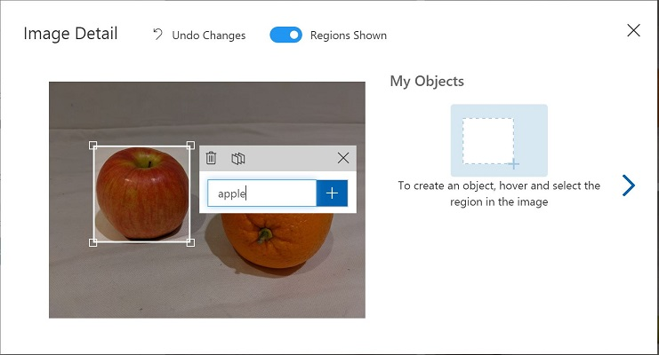

---
lab:
  title: Mendeteksi Objek dalam Gambar dengan Azure AI Custom Vision
---

# Mendeteksi Objek dalam Gambar dengan Azure AI Custom Vision

Dalam latihan ini, Anda akan menggunakan layanan Custom Vision untuk melatih model *deteksi objek* yang dapat mendeteksi dan menemukan tiga kelas buah (apel, pisang, dan jeruk) dalam sebuah gambar.

## Mengkloning repositori untuk kursus ini

Jika Anda sudah mengkloning repositori kode **mslearn-ai-vision** ke lingkungan tempat Anda bekerja di lab ini, buka di Visual Studio Code; jika belum, ikuti langkah-langkah ini untuk mengkloningnya sekarang.

1. Memulai Visual Studio Code.
2. Buka palet (SHIFT+CTRL+P) dan jalankan **Git: Perintah klon** untuk mengkloning repositori `https://github.com/MicrosoftLearning/mslearn-ai-vision` ke folder lokal (tidak masalah folder mana).
3. Setelah repositori dikloning, buka folder di Visual Studio Code.
4. Tunggu sementara file tambahan diinstal untuk mendukung proyek kode C# di repositori.

    > **Catatan**: Jika Anda diminta untuk menambahkan aset yang diperlukan guna membangun dan men-debug, pilih **Tidak Sekarang**.

## Buat sumber daya Custom Vision

Jika Anda sudah memiliki sumber daya **Custom Vision** untuk pelatihan dan prediksi di langganan Azure, Anda dapat menggunakannya dalam latihan ini. Jika tidak, gunakan instruksi berikut untuk membuatnya.

> **Catatan**: Jika Anda menggunakan akun multi-layanan, kunci dan titik akhir akan sama untuk pelatihan dan prediksi Anda.

1. Di tab browser baru, buka portal Microsoft Azure di `https://portal.azure.com`, dan masuk menggunakan akun Microsoft yang terkait dengan langganan Azure Anda.
2. Pilih tombol **&#65291;Buat sumber daya**, cari *custom vision*, dan buat sumber daya **Custom Vision** dengan pengaturan berikut:
    - **Buat opsi**: Keduanya
    - **Langganan**: *Langganan Azure Anda*
    - **Grup sumber daya**: *Pilih atau buat grup sumber daya (jika Anda menggunakan langganan terbatas, Anda mungkin tidak memiliki izin untuk membuat grup sumber daya baru - gunakan yang disediakan)*
    - **Wilayah**: *Pilih wilayah yang tersedia*
    - **Nama**: *Masukkan nama unik*
    - **Tingkat harga pelatihan**: F0
    - **Tingkat harga prediksi**: F0

    > **Catatan**: Jika Anda sudah memiliki layanan custom vision F0 di langganan, pilih **S0** untuk yang satu ini.

3. Tunggu hingga sumber daya dibuat, lalu lihat detail penyebaran dan perhatikan bahwa dua sumber daya Custom Vision telah disediakan; satu untuk pelatihan, dan satu lagi untuk prediksi (dibuktikan dengan akhiran **-Prediksi**). Anda dapat melihat ini dengan menavigasi ke grup sumber daya tempat Anda membuatnya.

> **Penting**: Setiap sumber daya memiliki *titik akhir* dan *kunci* sendiri, yang digunakan untuk mengelola akses dari kode Anda. Untuk melatih model klasifikasi gambar, kode Anda harus menggunakan sumber daya *pelatihan* (dengan titik akhir dan kuncinya); dan untuk menggunakan model terlatih untuk memprediksi kelas gambar, kode Anda harus menggunakan sumber daya *prediksi* (dengan titik akhir dan kuncinya).

## Membuat proyek Visual Kustom

Untuk melatih model deteksi objek, Anda perlu membuat proyek Custom Vision berdasarkan sumber daya pelatihan. Untuk melakukannya, Anda akan menggunakan portal Custom Vision.

1. Di tab browser baru, buka portal Custom Vision di `https://customvision.ai`, dan masuk menggunakan akun Microsoft yang terkait dengan langganan Azure Anda.
2. Buat proyek baru dengan pengaturan berikut:
    - **Nama**: Deteksi Buah
    - **Deskripsi**: Deteksi objek untuk buah.
    - **Sumber daya**: *Sumber daya Custom Vision yang Anda buat sebelumnya*
    - **Jenis Proyek**: Deteksi Objek
    - **Domain**: Umum
3. Tunggu proyek dibuat dan dibuka di browser.

## Tambahkan dan beri tag gambar

Untuk melatih model deteksi objek, Anda perlu mengunggah gambar yang berisi kelas yang ingin diidentifikasi oleh model, dan memberi tag gambar untuk menunjukkan kotak pembatas untuk setiap instans objek.

1. Di Visual Studio Code, lihat gambar pelatihan di folder **Labfiles/03-object-detection/training-images** tempat Anda mengkloning repositori. Folder ini berisi gambar buah.
2. Di portal Custom Vision, di proyek deteksi objek Anda, pilih **Tambah gambar** dan unggah semua gambar dalam folder yang diekstrak.
3. Setelah gambar diunggah, pilih yang pertama untuk membukanya.
4. Tahan mouse di atas objek apa pun pada gambar hingga wilayah yang terdeteksi secara otomatis ditampilkan seperti gambar di bawah ini. Kemudian pilih objek, dan jika perlu ubah ukuran wilayah untuk mengelilinginya.

    

    Atau, Anda cukup menyeret objek untuk membuat wilayah.

5. Saat wilayah mengelilingi objek, tambahkan tag baru dengan jenis objek yang sesuai (*apel*, *pisang*, atau *jeruk*) seperti yang ditunjukkan di sini:

    

6. Pilih dan beri tag satu sama lain pada objek dalam gambar, ubah ukuran wilayah dan tambahkan tag baru sesuai kebutuhan.

    

7. Gunakan tautan **>** di sebelah kanan untuk membuka gambar berikutnya, dan beri tag pada objeknya. Kemudian terus kerjakan seluruh kumpulan gambar, beri tag pada setiap apel, pisang, dan jeruk.

8. Setelah Anda selesai memberi tag pada gambar terakhir, tutup editor **Detail Gambar** . Pada halaman **Gambar Pelatihan** di bawah **Tag**, pilih **Ditandai** untuk melihat semua gambar yang ditandai:


## Gunakan API Pelatihan untuk mengunggah gambar

Anda dapat menggunakan UI di portal Custom Vision untuk menandai gambar Anda, tetapi banyak tim pengembangan AI menggunakan alat lain yang menghasilkan file yang berisi informasi tentang tag dan wilayah objek dalam gambar. Dalam skenario seperti ini, Anda dapat menggunakan API pelatihan Custom Vision untuk mengunggah gambar yang ditandai ke proyek.

> **Catatan**: Dalam latihan ini, Anda dapat memilih untuk menggunakan API dari **C#** atau **Python** SDK. Dalam langkah-langkah di bawah ini, lakukan tindakan yang sesuai untuk bahasa pilihan Anda.

1. Klik ikon *pengaturan* (&#9881;) di kanan atas halaman **Gambar Pelatihan** di portal Custom Vision untuk melihat pengaturan proyek.
2. Di bawah **Umum** (di sebelah kiri), perhatikan **Project Id** yang secara unik mengidentifikasi proyek ini.
3. Di sebelah kanan, di bawah **Sumber daya** perhatikan bahwa kunci dan titik akhir ditampilkan. Ini adalah detail untuk sumber daya *pelatihan* (Anda juga dapat memperoleh informasi ini dengan melihat sumber daya di portal Microsoft Azure).
4. Di Visual Studio Code, di bawah folder **Labfiles/03-object-detection**, luaskan folder **C-Sharp** atau **Python** bergantung pada preferensi bahasa Anda.
5. Klik kanan folder **train-detector** dan buka terminal terintegrasi. Kemudian instal paket Pelatihan Custom Vision dengan menjalankan perintah yang sesuai untuk preferensi bahasa Anda:

**C#**

```
dotnet add package Microsoft.Azure.CognitiveServices.Vision.CustomVision.Training --version 2.0.0
```

**Python**

```
pip install azure-cognitiveservices-vision-customvision==3.1.1
```

6. Lihat konten folder **train-detector**, dan perhatikan bahwa folder tersebut berisi file untuk setelan konfigurasi:
    - **C#**: appsettings.json
    - **Python**: .env

    Buka file konfigurasi dan perbarui nilai konfigurasi yang dikandungnya untuk mencerminkan titik akhir dan kunci untuk sumber daya *pelatihan* Custom Vision Anda, dan ID proyek untuk proyek deteksi objek yang Anda buat sebelumnya. Simpan perubahan Anda.

7. Di folder **train-detector**, buka **tagged-images.json** dan periksa JSON yang ada di dalamnya. JSON mendefinisikan daftar gambar, masing-masing berisi satu atau beberapa wilayah yang ditandai. Setiap wilayah yang diberi tag menyertakan nama tag, dan koordinat dan lebar serta lebar dan tinggi atas kotak pembatas yang berisi objek yang diberi tag.

    > **Catatan**: Koordinat dan dimensi dalam file ini menunjukkan titik relatif pada gambar. Misalnya, nilai *height* 0,7 menunjukkan kotak yang 70% dari tinggi gambar. Beberapa alat pemberian tag menghasilkan format file lain di mana nilai koordinat dan dimensi mewakili piksel, inci, atau unit pengukuran lainnya.

8. Perhatikan bahwa folder **train-detector** berisi subfolder tempat file gambar yang dirujuk dalam file JSON disimpan.

9. Perhatikan bahwa folder **train-detector** berisi file kode untuk aplikasi klien:

    - **C#**: Program.cs
    - **Python**: train-detector.py

    Buka file kode dan tinjau kode yang ada di dalamnya, perhatikan detail berikut:
    - Ruang nama dari paket yang Anda instal diimpor
    - Fungsi **Utama** mengambil pengaturan konfigurasi, dan menggunakan kunci dan titik akhir untuk membuat **CustomVisionTrainingClient** yang diautentikasi, yang kemudian digunakan dengan ID proyek untuk membuat **Proyek** referensi ke proyek Anda.
    - Fungsi **Upload_Images** mengekstrak informasi wilayah yang diberi tag dari file JSON dan menggunakannya untuk membuat batch gambar dengan wilayah, yang kemudian diunggah ke proyek.

10. Kembalikan terminal terintegrasi untuk folder **train-detector**, dan masukkan perintah berikut untuk menjalankan program:
    
    **C#**
    
    ```
    dotnet run
    ```
    
    **Python**
    
    ```
    python train-detector.py
    ```
    
11. Tunggu hingga program berakhir. Kemudian kembali ke browser Anda dan lihat halaman **Gambar Pelatihan** untuk proyek Anda di portal Custom Vision (menyegarkan browser jika perlu).
12. Verifikasi bahwa beberapa gambar baru yang diberi tag telah ditambahkan ke proyek.

## Latih dan uji model

Sekarang setelah memberi tag gambar dalam proyek, Anda siap untuk melatih model. Anda

1. Dalam proyek Custom Vision, klik **Latih** untuk melatih model deteksi objek menggunakan gambar yang diberi tag. Pilih opsi **Pelatihan Cepat**.
2. Tunggu hingga pelatihan selesai (perlu waktu kurang lebih sepuluh menit), lalu tinjau metrik performa *Presisi*, *Pendahuluan*, dan *mAP* - ketiganya mengukur akurasi prediksi model klasifikasi, dan semuanya harus tinggi.
3. Di kanan atas halaman, klik **Uji Cepat**, lalu di kotak **URL Gambar**, masukkan `https://aka.ms/apple-orange` dan lihat prediksi yang dihasilkan. Kemudian tutup jendela **Uji Cepat**.

## Terbitkan model deteksi objek

Sekarang Anda siap untuk memublikasikan model terlatih Anda sehingga dapat digunakan dari aplikasi klien.

1. Di portal Visi Khusus, pada halaman **Kinerja**, klik **&#128504; Publikasikan** untuk memublikasikan model terlatih dengan pengaturan berikut:
    - **Nama model**: fruit-detector
    - **Sumber Daya Prediksi**: *Sumber daya **prediksi** yang Anda buat sebelumnya yang diakhiri dengan "-Prediction" (<u>bukan</u> sumber pelatihan)*.
2. Di kiri atas halaman **Pengaturan Proyek**, klik ikon *Galeri Proyek* (&#128065;) untuk kembali ke beranda portal Custom Vision, tempat proyek Anda sekarang terdaftar.
3. Pada beranda portal Custom Vision, di kanan atas, klik ikon *pengaturan* (&#9881;) untuk melihat pengaturan layanan Custom Vision Anda. Kemudian, di bawah **Sumber Daya**, temukan sumber daya *prediksi* Anda yang diakhiri dengan "-Prediksi" (<u>bukan</u> sumber daya pelatihan) untuk menentukan **Kunci** dan nilai **Titik Akhir** (Anda juga dapat memperoleh informasi ini dengan melihat sumber daya di portal Microsoft Azure).

## Gunakan pengklasifikasi gambar dari aplikasi klien

Sekarang setelah Anda memublikasikan model klasifikasi gambar, Anda dapat menggunakannya dari aplikasi klien. Sekali lagi, Anda dapat memilih untuk menggunakan **C#** atau **Python**.

1. Di Visual Studio Code, telusuri ke folder **Labfiles/03-object-detection** dan di folder untuk bahasa pilihan Anda (**C-Sharp** atau **Python**), perluas folder **test-detector**.
2. Klik kanan folder **test-detector** dan buka terminal terintegrasi. Kemudian masukkan perintah khusus SDK berikut untuk menginstal paket Prediksi Visi Kustom:

**C#**

```
dotnet add package Microsoft.Azure.CognitiveServices.Vision.CustomVision.Prediction --version 2.0.0
```

**Python**

```
pip install azure-cognitiveservices-vision-customvision==3.1.1
```

> **Catatan**: Paket Python SDK mencakup paket pelatihan dan prediksi, dan mungkin sudah diinstal.

3. Buka file konfigurasi untuk aplikasi klien Anda (*appsettings.json* untuk C# atau *.env* untuk Python) dan perbarui nilai konfigurasi yang dikandungnya untuk mencerminkan titik akhir dan kunci untuk sumber daya *prediksi* Custom Vision Anda, ID proyek untuk proyek deteksi objek, dan nama model yang Anda publikasikan (yang seharusnya *fruit-detector*). Simpan perubahan Anda.
4. Buka file kode untuk aplikasi klien Anda (*Program.cs* untuk C#, *test-detector.py* untuk Python) dan tinjau kode yang ada di dalamnya, perhatikan detail berikut:
    - Ruang nama dari paket yang Anda instal diimpor
    - Fungsi **Utama** mengambil pengaturan konfigurasi, dan menggunakan kunci dan titik akhir untuk membuat **CustomVisionPredictionClient** yang diautentikasi.
    - Objek klien prediksi digunakan untuk mendapatkan prediksi deteksi objek untuk gambar **produce.jpg**, menentukan ID proyek dan nama model dalam permintaan. Wilayah yang ditandai yang diprediksi kemudian digambar pada gambar, dan hasilnya disimpan sebagai **output.jpg**.
5. Kembali ke terminal terintegrasi untuk folder **test-detector**, dan masukkan perintah berikut untuk menjalankan program:

**C#**

```
dotnet run
```

**Python**

```
python test-detector.py
```

6. Setelah program selesai, lihat file **output.jpg** yang dihasilkan untuk melihat objek yang terdeteksi dalam gambar.

## Informasi selengkapnya

Untuk informasi lebih lanjut tentang deteksi objek dengan layanan Custom Vision, lihat [dokumentasi Custom Vision](https://docs.microsoft.com/azure/cognitive-services/custom-vision-service/).
