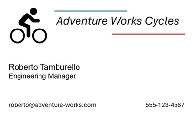

---
lab:
  title: Membaca teks dalam gambar
  description: Gunakan pengenalan karakter optik (OCR) di layanan Analisis Gambar Azure AI Visual untuk menemukan dan mengekstrak teks dalam gambar.
---

# Membaca teks dalam gambar

Pengenalan karakter optik (OCR) adalah bagian dari visi komputer yang berhubungan dengan membaca teks dalam gambar dan dokumen. Layanan Analisis Gambar **Azure AI Visual** menyediakan API untuk membaca teks, yang akan Anda pelajari dalam latihan ini.

> **Catatan**: Latihan ini didasarkan pada perangkat lunak SDK pra-rilis, yang mungkin dapat berubah. Jika perlu, kami telah menggunakan versi paket tertentu; yang mungkin tidak mencerminkan versi terbaru yang tersedia. Anda mungkin mengalami beberapa perilaku, peringatan, atau kesalahan tak terduga.

Meskipun latihan ini didasarkan pada SDK Python Analisis Azure Visual, Anda dapat mengembangkan aplikasi visual menggunakan beberapa SDK khusus bahasa; termasuk:

* [Analisis Azure AI Visual untuk JavaScript](https://www.npmjs.com/package/@azure-rest/ai-vision-image-analysis)
* [Analisis Azure AI Visual untuk Microsoft .NET](https://www.nuget.org/packages/Azure.AI.Vision.ImageAnalysis)
* [Analisis Azure AI Visual untuk Java](https://mvnrepository.com/artifact/com.azure/azure-ai-vision-imageanalysis)

Latihan ini memakan waktu sekitar **30** menit.

## Menyediakan sumber daya Azure AI Visual

Jika belum memilikinya di langganan, Anda harus menyediakan sumber daya Azure AI Visual.

> **Catatan**: Dalam latihan ini, Anda akan menggunakan sumber daya **Computer Vision** mandiri. Anda juga dapat menggunakan layanan Azure AI Visual di sumber daya multilayanan *Layanan Azure AI*, baik secara langsung atau dalam proyek *Azure AI Foundry*.

1. Buka [portal Azure](https://portal.azure.com) di `https://portal.azure.com` dan masuk menggunakan kredensial Azure Anda. Tutup pesan sambutan atau tips apa pun yang ditampilkan.
1. Pilih **Buat sumber daya**.
1. Di bilah pencarian, cari `Computer Vision`, pilih **Computer Vision**, dan buat sumber daya dengan pengaturan berikut:
    - **Langganan**: *Langganan Azure Anda*
    - **Grup sumber daya**: *Buat atau pilih grup sumber daya*
    - **Wilayah**: *Pilih dari **US Timur**, **US Barat**, **Prancis Tengah**, **Korea Tengah**, **Eropa Utara**, **Asia Tenggara**, **Eropa Barat**, atau **Asia Timur**\**
    - **Nama**: *Nama yang valid untuk sumber daya Computer Vision Anda*
    - **Tingkat harga**: Gratis F0

    \*Set fitur lengkap Azure AI Vision 4.0 saat ini hanya tersedia di wilayah ini.

1. Pilih kotak centang yang diperlukan dan buat sumber daya.
1. Tunggu hingga penyebaran selesai, lalu lihat detail penyebaran.
1. Ketika sumber daya telah disebarkan, buka dan di bawah node **Manajemen sumber daya** di panel navigasi, lihat halaman **Kunci dan Titik Akhir**. Anda akan memerlukan titik akhir dan salah satu kunci dari halaman ini dalam prosedur selanjutnya.

## Mengembangkan aplikasi ekstraksi teks dengan SDK Azure AI Visual

Dalam latihan ini, Anda akan menyelesaikan aplikasi klien yang diimplementasikan sebagian yang menggunakan SDK Azure AI Visual untuk mengekstrak teks dari gambar.

### Menyiapkan konfigurasi aplikasi

1. Di portal Azure, gunakan tombol **[\>_]** di sebelah kanan bilah pencarian di bagian atas halaman untuk membuat Cloud Shell baru di portal Azure, dengan memilih lingkungan ***PowerShell ***dengan tidak ada penyimpanan pada langganan Anda.

    Cloud shell menyediakan antarmuka baris perintah dalam panel di bagian bawah portal Azure.

    > **Catatan**: Jika sebelumnya Anda telah membuat cloud shell yang menggunakan lingkungan *Bash* , alihkan ke ***PowerShell***.

    > **Catatan**: Jika portal meminta Anda untuk memilih penyimpanan untuk mempertahankan file Anda, pilih **Tidak ada akun penyimpanan yang diperlukan**, pilih langganan yang Anda gunakan dan tekan **Terapkan**.

1. Di toolbar cloud shell, di menu **Pengaturan**, pilih **Buka versi Klasik** (ini diperlukan untuk menggunakan editor kode).

    **<font color="red">Pastikan Anda telah beralih ke versi klasik cloud shell sebelum melanjutkan.</font>**

1. Ubah ukuran panel cloud shell sehingga Anda masih dapat melihat halaman **Kunci dan Titik Akhir** untuk sumber daya Computer Vision Anda.

    > **Tips**" Anda bisa mengubah ukuran panel dengan menyeret batas atas. Anda juga dapat menggunakan tombol minimalkan dan maksimalkan untuk beralih antara shell cloud dan antarmuka portal utama.

1. Di panel cloud shell, masukkan perintah berikut untuk mengkloning repo GitHub yang berisi file kode untuk latihan ini (ketik perintah, atau salin ke clipboard lalu klik kanan di baris perintah dan tempel sebagai teks biasa):

    ```
    rm -r mslearn-ai-vision -f
    git clone https://github.com/MicrosoftLearning/mslearn-ai-vision
    ```

    > **Tips**: Saat Anda menempelkan perintah ke cloudshell, ouputnya mungkin mengambil sejumlah besar buffer layar. Anda dapat menghapus layar dengan memasukkan `cls` perintah untuk mempermudah fokus pada setiap tugas.

1. Setelah repositori dikloning, gunakan perintah berikut untuk menavigasi ke folder berisi file kode aplikasi:

    ```
   cd mslearn-ai-vision/Labfiles/ocr/python/read-text
   ls -a -l
    ```

    Folder berisi konfigurasi aplikasi dan file kode untuk aplikasi Anda. Folder ini juga berisi subfolder **/images**, yang berisi beberapa file gambar untuk dianalisis aplikasi Anda.

1. Instal paket SDK Azure AI Visual dan paket lain yang diperlukan dengan menjalankan perintah berikut:

    ```
   python -m venv labenv
   ./labenv/bin/Activate.ps1
   pip install -r requirements.txt azure-ai-vision-imageanalysis==1.0.0
    ```

1. Masukkan perintah berikut untuk mengedit file konfigurasi untuk aplikasi Anda:

    ```
   code .env
    ```

    File dibuka dalam editor kode.

1. Dalam file kode, perbarui nilai konfigurasi di dalamnya untuk mencerminkan **titik akhir** dan **kunci** autentikasi untuk sumber daya Computer Vision Anda (disalin dari halaman **Kunci dan Titik Akhir** di portal Azure).
1. Setelah Anda mengganti tempat penampung, gunakan perintah **CTRL+S** untuk menyimpan perubahan Anda lalu gunakan perintah **CTRL+Q** untuk menutup editor kode sambil menjaga baris perintah cloud shell tetap terbuka.

### Menambahkan kode untuk membaca teks dari gambar

1. Di baris perintah cloud shell, masukkan perintah berikut untuk membuka file kode untuk aplikasi klien:

    ```
   code read-text.py
    ```

    > **Tips**: Anda mungkin ingin memaksimalkan panel cloud shell dan memindahkan bilah terpisah antara konsol baris perintah dan editor kode sehingga Anda dapat melihat kode dengan lebih mudah.

1. Dalam file kode, temukan komentar **Impor namespace layanan**, dan tambahkan kode berikut untuk mengimpor namespace layanan yang akan Anda perlukan untuk menggunakan SDK Azure AI Visual:

    ```python
   # import namespaces
   from azure.ai.vision.imageanalysis import ImageAnalysisClient
   from azure.ai.vision.imageanalysis.models import VisualFeatures
   from azure.core.credentials import AzureKeyCredential
    ```

1. Dalam fungsi **Utama**, kode untuk memuat pengaturan konfigurasi dan menentukan file yang akan dianalisis telah disediakan. Kemudian temukan komentar **Autentikasi klien Azure AI Visual** dan tambahkan kode khusus bahasa berikut untuk membuat dan mengautentikasi objek klien Analisis Gambar Azure AI Visual:

    ```python
   # Authenticate Azure AI Vision client
   cv_client = ImageAnalysisClient(
        endpoint=ai_endpoint,
        credential=AzureKeyCredential(ai_key))
    ```

1. Di fungsi **Utama**, di bawah kode yang baru saja Anda tambahkan, temukan komentar **Baca teks dalam gambar** dan tambahkan kode berikut untuk menggunakan klien Analisis Gambar untuk membaca teks dalam gambar:

    ```python
   # Read text in image
   with open(image_file, "rb") as f:
        image_data = f.read()
   print (f"\nReading text in {image_file}")

   result = cv_client.analyze(
        image_data=image_data,
        visual_features=[VisualFeatures.READ])
    ```

1. Temukan komentar **Cetak teks** dan tambahkan kode berikut (termasuk komentar akhir) untuk mencetak baris teks yang ditemukan dan memanggil fungsi untuk membuat anotasi dalam gambar (menggunakan **bounding_polygon** yang ditampilkan untuk setiap baris teks):

    ```python
   # Print the text
   if result.read is not None:
        print("\nText:")
    
        for line in result.read.blocks[0].lines:
            print(f" {line.text}")        
        # Annotate the text in the image
        annotate_lines(image_file, result.read)

        # Find individual words in each line
        
    ```

1. Simpan perubahan Anda (*CTRL+S*) tetapi biarkan editor kode terbuka jika Anda perlu memperbaiki kesalahan ejaan apa pun.

1. Ubah ukuran panel sehingga Anda dapat melihat lebih banyak bagian konsol, lalu masukkan perintah berikut untuk menjalankan program:

    ```
   python read-text.py images/Lincoln.jpg
    ```

1. Program membaca teks dalam file gambar yang ditentukan (*images/Lincoln.jpg*), yang tampak seperti ini:

    

1. Di folder **read-text**, gambar **lines.jpg** telah dibuat. Gunakan perintah **unduhan** (khusus Azure Cloud Shell) untuk mengunduhnya:

    ```
   download lines.jpg
    ```

    Perintah unduh membuat tautan popup di kanan bawah browser Anda, yang dapat Anda pilih untuk mengunduh dan membuka file. Gambar akan tampak seperti berikut ini:

    

1. Jalankan program lagi, kali ini tentukan parameter *images/Business-card.jpg* untuk mengekstrak teks dari gambar berikut:

    

    ```
   python read-text.py images/Business-card.jpg
    ```

1. Unduh dan lihat file **lines.jpg** yang dihasilkan:

    ```
   download lines.jpg
    ```

1. Jalankan program sekali lagi, kali ini dengan menentukan parameter *images/Note.jpg* untuk mengekstrak teks dari gambar ini:

    

    ```
   python read-text.py images/Note.jpg
    ```

1. Unduh dan lihat file **lines.jpg** yang dihasilkan:

    ```
   download lines.jpg
    ```

### Menambahkan kode untuk mengembalikan posisi kata individual

1. Ubah ukuran panel sehingga Anda bisa melihat lebih banyak file kode. Temukan komentar **Temukan kata individu dalam setiap baris** dan tambahkan kode berikut (berhati-hatilah untuk mempertahankan tingkat indentasi yang benar):

    ```python
   # Find individual words in each line
   print ("\nIndividual words:")
   for line in result.read.blocks[0].lines:
        for word in line.words:
            print(f"  {word.text} (Confidence: {word.confidence:.2f}%)")
   # Annotate the words in the image
   annotate_words(image_file, result.read)
    ```

1. Simpan perubahan Anda (*CTRL+S*). Kemudian, di panel baris perintah, jalankan ulang program untuk mengekstrak teks dari *images/Lincoln.jpg*.
1. Amati output, yang harus menyertakan setiap kata individu dalam gambar dan keyakinan yang terkait dengan prediksinya.
1. Di folder **read-text**, gambar **words.jpg** telah dibuat. Gunakan perintah **unduhan** (khusus Azure Cloud Shell) untuk mengunduh dan melihatnya:

    ```
   download words.jpg
    ```

1. Jalankan ulang program untuk *images/Business-card.jpg* dan *images/Note.jpg*; melihat file **words.jpg** yang dihasilkan untuk setiap gambar.

## Membersihkan sumber daya

Setelah selesai menjelajahi Azure AI Visual, Anda harus menghapus sumber daya yang telah Anda buat dalam latihan ini untuk menghindari biaya Azure yang tidak perlu:

1. Buka portal Microsoft Azure di `https://portal.azure.com`, dan masuk menggunakan akun Microsoft yang terkait dengan langganan Azure Anda.

1. Di bilah pencarian atas, cari *Computer Vision*, lalu pilih sumber daya Computer Vision yang Anda buat di lab ini.

1. Pada halaman sumber daya, pilih **Hapus** dan ikuti instruksi untuk menghapus sumber daya.
