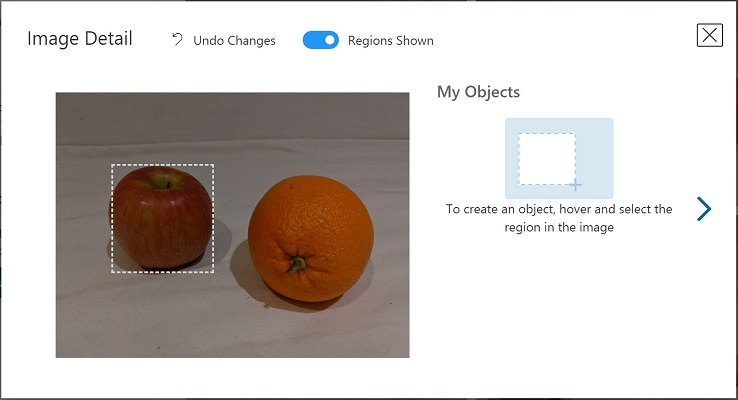

---
lab:
  title: Mendeteksi Objek dalam Gambar dengan Azure AI Custom Vision
---

# Mendeteksi Objek dalam Gambar dengan Azure AI Custom Vision

Dalam latihan ini, Anda akan menggunakan layanan Custom Vision untuk melatih model *deteksi objek* yang dapat mendeteksi dan menemukan tiga kelas buah (apel, pisang, dan jeruk) dalam sebuah gambar.

## Buat sumber daya Custom Vision

Jika Anda sudah memiliki sumber daya **Custom Vision** untuk pelatihan dan prediksi di langganan Azure, Anda dapat menggunakannya dalam latihan ini. Jika tidak, gunakan instruksi berikut untuk membuatnya.

> **Catatan**: Jika Anda menggunakan akun multi-layanan, kunci dan titik akhir akan sama untuk pelatihan dan prediksi Anda.

1. Di tab browser baru, buka portal Microsoft Azure di `https://portal.azure.com`, dan masuk menggunakan akun Microsoft yang terkait dengan langganan Azure Anda.
1. Pilih tombol **&#65291;Buat sumber daya**, cari *custom vision*, dan buat sumber daya **Custom Vision** dengan pengaturan berikut:
    - **Buat opsi**: Keduanya
    - **Langganan**: *Langganan Azure Anda*
    - **Grup sumber daya**: *Pilih atau buat grup sumber daya (jika Anda menggunakan langganan terbatas, Anda mungkin tidak memiliki izin untuk membuat grup sumber daya baru - gunakan yang disediakan)*
    - **Wilayah**: *Pilih wilayah yang tersedia*
    - **Nama**: *Masukkan nama unik*
    - **Tingkat harga pelatihan**: F0
    - **Tingkat harga prediksi**: F0

    > **Catatan**: Jika Anda sudah memiliki layanan custom vision F0 di langganan, pilih **S0** untuk yang satu ini.

1. Tunggu hingga sumber daya dibuat, lalu lihat detail penyebaran dan perhatikan bahwa dua sumber daya Custom Vision telah disediakan; satu untuk pelatihan, dan satu lagi untuk prediksi (dibuktikan dengan akhiran **-Prediksi**). Anda dapat melihat ini dengan menavigasi ke grup sumber daya tempat Anda membuatnya.

> **Penting**: Setiap sumber daya memiliki *titik akhir* dan *kunci* sendiri, yang digunakan untuk mengelola akses dari kode Anda. Untuk melatih model klasifikasi gambar, kode Anda harus menggunakan sumber daya *pelatihan* (dengan titik akhir dan kuncinya); dan untuk menggunakan model terlatih untuk memprediksi kelas gambar, kode Anda harus menggunakan sumber daya *prediksi* (dengan titik akhir dan kuncinya).

## Mengkloning repositori untuk kursus ini

Anda akan mengembangkan kode menggunakan Cloud Shell dari portal Azure. File kode untuk aplikasi Anda telah disediakan dalam repositori GitHub.

> **Tips**: Jika Anda sudah mengkloning repositori **mslearn-ai-vision** baru-baru ini, Anda dapat melewati tugas ini. Jika belum melakukannya, ikuti langkah-langkah berikut untuk mengkloningnya ke lingkungan pengembangan Anda.

1. Gunakan tombol **[\>_]** di sebelah kanan bilah pencarian di bagian atas halaman untuk membuat Cloud Shell baru di portal Azure, dengan memilih lingkungan ***PowerShell***. Cloud shell menyediakan antarmuka baris perintah dalam panel di bagian bawah portal Azure.

    > **Catatan**: Jika sebelumnya Anda telah membuat cloud shell yang menggunakan lingkungan *Bash* , alihkan ke ***PowerShell***.

1. Di toolbar cloud shell, di menu **Pengaturan**, pilih **Buka versi Klasik** (ini diperlukan untuk menggunakan editor kode).

    > **Tips**: Saat Anda menempelkan perintah ke cloudshell, ouput mungkin mengambil sejumlah besar buffer layar. Anda dapat menghapus layar dengan memasukkan `cls` perintah untuk mempermudah fokus pada setiap tugas.

1. Di panel PowerShell, masukkan perintah berikut untuk mengkloning repositori GitHub untuk latihan ini:

    ```
    rm -r mslearn-ai-vision -f
    git clone https://github.com/microsoftlearning/mslearn-ai-vision mslearn-ai-vision
    ```

1. Setelah repositori dikloning, navigasikan ke folder yang berisi file kode aplikasi:  

    ```
   cd mslearn-ai-vision/Labfiles/03-object-detection
    ```

## Membuat proyek Visual Kustom

Untuk melatih model deteksi objek, Anda perlu membuat proyek Custom Vision berdasarkan sumber daya pelatihan. Untuk melakukannya, Anda akan menggunakan portal Custom Vision.

1. Di tab browser baru, buka portal Custom Vision di `https://customvision.ai`, dan masuk menggunakan akun Microsoft yang terkait dengan langganan Azure Anda.
1. Buat proyek baru dengan pengaturan berikut:
    - **Nama**: Deteksi Buah
    - **Deskripsi**: Deteksi objek untuk buah.
    - **Sumber daya**: *Sumber daya Custom Vision yang Anda buat sebelumnya*
    - **Jenis Proyek**: Deteksi Objek
    - **Domain**: Umum
1. Tunggu proyek dibuat dan dibuka di browser.

## Tambahkan dan beri tag gambar

Untuk melatih model deteksi objek, Anda perlu mengunggah gambar yang berisi kelas yang ingin diidentifikasi oleh model, dan memberi tag gambar untuk menunjukkan kotak pembatas untuk setiap instans objek.

1. Di tab browser baru, unduh gambar pelatihan dari `https://github.com/MicrosoftLearning/mslearn-ai-vision/raw/main/Labfiles/03-object-detection/training-images.zip` dan ekstrak folder zip untuk melihat kontennya. Folder ini berisi gambar buah.
1. Di portal Custom Vision, di proyek deteksi objek Anda, pilih **Tambah gambar** dan unggah semua gambar dalam folder yang diekstrak.
1. Setelah gambar diunggah, pilih yang pertama untuk membukanya.
1. Tahan mouse di atas objek apa pun pada gambar hingga wilayah yang terdeteksi secara otomatis ditampilkan seperti gambar di bawah ini. Kemudian pilih objek, dan jika perlu ubah ukuran wilayah untuk mengelilinginya.

    

    Atau, Anda cukup menyeret objek untuk membuat wilayah.

1. Saat wilayah mengelilingi objek, tambahkan tag baru dengan jenis objek yang sesuai (*apel*, *pisang*, atau *jeruk*) seperti yang ditunjukkan di sini:

    

1. Pilih dan beri tag satu sama lain pada objek dalam gambar, ubah ukuran wilayah dan tambahkan tag baru sesuai kebutuhan.

    

1. Gunakan tautan **>** di sebelah kanan untuk membuka gambar berikutnya, dan beri tag pada objeknya. Kemudian terus kerjakan seluruh kumpulan gambar, beri tag pada setiap apel, pisang, dan jeruk.

1. Setelah Anda selesai memberi tag pada gambar terakhir, tutup editor **Detail Gambar** . Pada halaman **Gambar Pelatihan** di bawah **Tag**, pilih **Ditandai** untuk melihat semua gambar yang ditandai:


## Gunakan API Pelatihan untuk mengunggah gambar

Anda dapat menggunakan UI di portal Custom Vision untuk menandai gambar Anda, tetapi banyak tim pengembangan AI menggunakan alat lain yang menghasilkan file yang berisi informasi tentang tag dan wilayah objek dalam gambar. Dalam skenario seperti ini, Anda dapat menggunakan API pelatihan Custom Vision untuk mengunggah gambar yang ditandai ke proyek.

> **Catatan**: Dalam latihan ini, Anda dapat memilih untuk menggunakan API dari **C#** atau **Python** SDK. Dalam langkah-langkah di bawah ini, lakukan tindakan yang sesuai untuk bahasa pilihan Anda.

1. Klik ikon *pengaturan* (&#9881;) di kanan atas halaman **Gambar Pelatihan** di portal Custom Vision untuk melihat pengaturan proyek.
1. Di bawah **Umum** (di sebelah kiri), perhatikan **Project Id** yang secara unik mengidentifikasi proyek ini.
1. Di sebelah kanan, di bawah **Sumber daya** perhatikan bahwa kunci dan titik akhir ditampilkan. Ini adalah detail untuk sumber daya *pelatihan* (Anda juga dapat memperoleh informasi ini dengan melihat sumber daya di portal Microsoft Azure).
1. Kembali ke Portal Azure, jalankan perintah `cd C-Sharp/train-detector` atau `cd Python/train-detector` bergantung pada preferensi bahasa Anda.
1. Instal paket Pelatihan Custom Vision dengan menjalankan perintah yang sesuai untuk preferensi bahasa Anda:

    **C#**

    ```
   dotnet add package Microsoft.Azure.CognitiveServices.Vision.CustomVision.Training --version 2.0.0
    ```

    **Python**

    ```
   pip install azure-cognitiveservices-vision-customvision==3.1.1
    ```

1. Dengan menggunakan perintah `ls`, Anda dapat melihat konten folder **train-detector**. Perhatikan bahwa ini berisi file untuk pengaturan konfigurasi:

    - **C#**: appsettings.json
    - **Python**: .env

1. Masukkan perintah berikut untuk mengedit file konfigurasi yang telah disediakan:

    **C#**

    ```
   code appsettings.json
    ```

    **Python**

    ```
   code .env
    ```

    File dibuka dalam editor kode.

1. Dalam file kode, perbarui nilai konfigurasi yang ada di dalamnya untuk mencerminkan **titik akhir** dan **kunci** autentikasi untuk sumber daya *pelatihan* Custom Vision Anda, dan ID proyek untuk proyek deteksi objek yang Anda buat sebelumnya.
1. Setelah Anda mengganti tempat penampung, gunakan perintah **CTRL+S** atau **Klik kanan > Simpan** untuk menyimpan perubahan Anda dan kemudian gunakan perintah **CTRL+Q** atau **Klik kanan > Keluar** untuk menutup editor kode sambil tetap membuka baris perintah cloud shell.
1. Jalankan `code tagged-images.json` untuk membuka file dan periksa JSON yang ada di dalamnya. JSON mendefinisikan daftar gambar, masing-masing berisi satu atau beberapa wilayah yang ditandai. Setiap wilayah yang diberi tag menyertakan nama tag, dan koordinat dan lebar serta lebar dan tinggi atas kotak pembatas yang berisi objek yang diberi tag.

    > **Catatan**: Koordinat dan dimensi dalam file ini menunjukkan titik relatif pada gambar. Misalnya, nilai *height* 0,7 menunjukkan kotak yang 70% dari tinggi gambar. Beberapa alat pemberian tag menghasilkan format file lain di mana nilai koordinat dan dimensi mewakili piksel, inci, atau unit pengukuran lainnya.

1. Perhatikan bahwa folder **train-detector** berisi subfolder tempat file gambar yang dirujuk dalam file JSON disimpan.

1. Perhatikan bahwa folder **train-detector** berisi file kode untuk aplikasi klien:

    - **C#**: Program.cs
    - **Python**: train-detector.py

    Buka file kode dan tinjau kode yang ada di dalamnya, perhatikan detail berikut:
    - Ruang nama dari paket yang Anda instal diimpor
    - Fungsi **Utama** mengambil pengaturan konfigurasi, dan menggunakan kunci dan titik akhir untuk membuat **CustomVisionTrainingClient** yang diautentikasi, yang kemudian digunakan dengan ID proyek untuk membuat **Proyek** referensi ke proyek Anda.
    - Fungsi **Upload_Images** mengekstrak informasi wilayah yang diberi tag dari file JSON dan menggunakannya untuk membuat batch gambar dengan wilayah, yang kemudian diunggah ke proyek.

1. Jalankan perintah berikut untuk menjalankan program:
    
    **C#**
    
    ```
   dotnet run
    ```
    
    **Python**
    
    ```
   python train-detector.py
    ```
    
1. Tunggu hingga program berakhir. Kemudian kembali ke browser Anda dan lihat halaman **Gambar Pelatihan** untuk proyek Anda di portal Custom Vision (menyegarkan browser jika perlu).
1. Verifikasi bahwa beberapa gambar baru yang diberi tag telah ditambahkan ke proyek.

## Latih dan uji model

Sekarang setelah memberi tag gambar dalam proyek, Anda siap untuk melatih model.

1. Dalam proyek Custom Vision, klik **Latih** untuk melatih model deteksi objek menggunakan gambar yang diberi tag. Pilih opsi **Pelatihan Cepat**.
1. Tunggu hingga pelatihan selesai (perlu waktu kurang lebih sepuluh menit), lalu tinjau metrik performa *Presisi*, *Pendahuluan*, dan *mAP* - ketiganya mengukur akurasi prediksi model klasifikasi, dan semuanya harus tinggi.
1. Di kanan atas halaman, klik **Uji Cepat**, lalu di kotak **URL Gambar**, masukkan `https://aka.ms/apple-orange` dan lihat prediksi yang dihasilkan. Kemudian tutup jendela **Uji Cepat**.

## Terbitkan model deteksi objek

Sekarang Anda siap untuk memublikasikan model terlatih Anda sehingga dapat digunakan dari aplikasi klien.

1. Di portal Visi Khusus, pada halaman **Kinerja**, klik **&#128504; Publikasikan** untuk memublikasikan model terlatih dengan pengaturan berikut:
    - **Nama model**: fruit-detector
    - **Sumber Daya Prediksi**: *Sumber daya **prediksi** yang Anda buat sebelumnya yang diakhiri dengan "-Prediction" (<u>bukan</u> sumber pelatihan)*.
1. Di kiri atas halaman **Pengaturan Proyek**, klik ikon *Galeri Proyek* (&#128065;) untuk kembali ke beranda portal Custom Vision, tempat proyek Anda sekarang terdaftar.
1. Pada beranda portal Custom Vision, di kanan atas, klik ikon *pengaturan* (&#9881;) untuk melihat pengaturan layanan Custom Vision Anda. Kemudian, di bawah **Sumber Daya**, temukan sumber daya *prediksi* Anda yang diakhiri dengan "-Prediksi" (<u>bukan</u> sumber daya pelatihan) untuk menentukan **Kunci** dan nilai **Titik Akhir** (Anda juga dapat memperoleh informasi ini dengan melihat sumber daya di portal Microsoft Azure).

## Gunakan pengklasifikasi gambar dari aplikasi klien

Sekarang setelah Anda memublikasikan model klasifikasi gambar, Anda dapat menggunakannya dari aplikasi klien. Sekali lagi, Anda dapat memilih untuk menggunakan **C#** atau **Python**.

1. Di Portal Azure, buka folder **test-detector** yang menjalankan perintah `cd ../test-detector`.
1. Masukkan perintah khusus SDK berikut untuk menginstal paket Prediksi Custom Vision:

    **C#**

    ```
   dotnet add package Microsoft.Azure.CognitiveServices.Vision.CustomVision.Prediction --version 2.0.0
    ```

    **Python**

    ```
   pip install azure-cognitiveservices-vision-customvision==3.1.1
    ```

> **Catatan**: Paket Python SDK mencakup paket pelatihan dan prediksi, dan mungkin sudah diinstal.

1. Buka file konfigurasi untuk aplikasi klien Anda (*appsettings.json* untuk C# atau *.env* untuk Python) dan perbarui nilai konfigurasi yang dikandungnya untuk mencerminkan titik akhir dan kunci untuk sumber daya *prediksi* Custom Vision Anda, ID proyek untuk proyek deteksi objek, dan nama model yang Anda publikasikan (yang seharusnya *fruit-detector*). Simpan perubahan Anda dan tutup file.
1. Buka file kode untuk aplikasi klien Anda (*Program.cs* untuk C#, *test-detector.py* untuk Python) dan tinjau kode yang ada di dalamnya, perhatikan detail berikut:
    - Ruang nama dari paket yang Anda instal diimpor
    - Fungsi **Utama** mengambil pengaturan konfigurasi, dan menggunakan kunci dan titik akhir untuk membuat **CustomVisionPredictionClient** yang diautentikasi.
    - Objek klien prediksi digunakan untuk mendapatkan prediksi deteksi objek untuk gambar **produce.jpg**, menentukan ID proyek dan nama model dalam permintaan. Wilayah yang ditandai yang diprediksi kemudian digambar pada gambar, dan hasilnya disimpan sebagai **output.jpg**.
1. Tutup editor kode dan masukkan perintah berikut untuk menjalankan program:

    **C#**

    ```
   dotnet run
    ```

    **Python**

    ```
   python test-detector.py
    ```

1. Setelah program selesai, di bar alat cloud shell, pilih **Unggah/Unduh file** lalu **Unduh**. Dalam kotak dialog baru, masukkan jalur file berikut dan pilih **Unduh**:

    **C#**
   
    ```
   mslearn-ai-vision/Labfiles/03-object-detection/C-Sharp/test-detector/output.jpg
    ```

    **Python**
   
    ```
   mslearn-ai-vision/Labfiles/03-object-detection/Python/test-detector/output.jpg
    ```

1. Lihat file **output.jpg** yang dihasilkan untuk melihat objek yang terdeteksi dalam gambar.

## Membersihkan sumber daya

Jika Anda tidak menggunakan sumber daya Azure yang dibuat di lab ini untuk modul pelatihan lainnya, Anda dapat menghapusnya untuk menghindari dikenakan biaya lebih lanjut.

1. Buka portal Microsoft Azure di`https://portal.azure.com`, dan di bilah pencarian atas, cari sumber daya yang Anda buat di lab ini.

1. Pada halaman sumber daya, pilih **Hapus** dan ikuti instruksi untuk menghapus sumber daya. Atau, Anda dapat menghapus seluruh grup sumber daya untuk membersihkan semua sumber daya secara bersamaan.
   
## Informasi selengkapnya

Untuk informasi lebih lanjut tentang deteksi objek dengan layanan Custom Vision, lihat [dokumentasi Custom Vision](https://docs.microsoft.com/azure/cognitive-services/custom-vision-service/).
