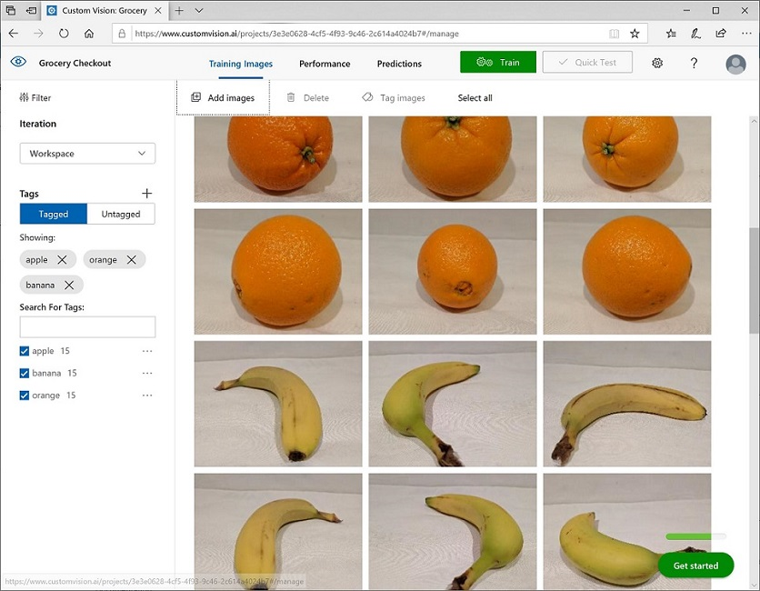
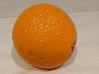

---
lab:
  title: Mengklasifikasikan gambar
  description: Gunakan layanan Azure AI Custom Vision untuk melatih model klasifikasi gambar.
---

# Mengklasifikasikan gambar

Layanan **Azure AI Custom Vision** memungkinkan Anda membuat model penglihatan komputer yang dilatih berdasarkan gambar Anda sendiri. Anda dapat menggunakannya untuk melatih model *klasifikasi gambar* dan *deteksi objek*; yang kemudian dapat Anda publikasikan dan konsumsi dari aplikasi.

Dalam latihan ini, Anda akan menggunakan layanan Custom Vision untuk melatih model klasifikasi gambar yang dapat mengidentifikasi tiga kelas buah (apel, pisang, dan jeruk).

Meskipun latihan ini didasarkan pada SDK Python Azure Custom Vision, Anda dapat mengembangkan aplikasi visual menggunakan beberapa SDK khusus bahasa; termasuk:

* [Azure Custom Vision untuk JavaScript (pelatihan)](https://www.npmjs.com/package/@azure/cognitiveservices-customvision-training)
* [Azure Custom Vision untuk JavaScript (prediksi)](https://www.npmjs.com/package/@azure/cognitiveservices-customvision-prediction)
* [Azure Custom Vision untuk Microsoft .NET (pelatihan)](https://www.nuget.org/packages/Microsoft.Azure.CognitiveServices.Vision.CustomVision.Training/)
* [Azure Custom Vision untuk Microsoft .NET (prediksi)](https://www.nuget.org/packages/Microsoft.Azure.CognitiveServices.Vision.CustomVision.Prediction/)
* [Azure Custom Vision untuk Java (pelatihan)](https://search.maven.org/artifact/com.azure/azure-cognitiveservices-customvision-training/1.1.0-preview.2/jar)
* [Azure Custom Vision untuk Java (prediksi)](https://search.maven.org/artifact/com.azure/azure-cognitiveservices-customvision-prediction/1.1.0-preview.2/jar)

Latihan ini memakan waktu sekitar **45** menit.

## Buat sumber daya Custom Vision

Sebelum dapat melatih model, Anda memerlukan sumber daya Azure untuk *pelatihan* dan *prediksi*. Anda dapat membuat sumber daya **Custom Vision** untuk setiap tugas ini, atau Anda dapat membuat satu sumber daya dan menggunakannya untuk keduanya. Dalam latihan ini, Anda akan membuat sumber daya **Custom Vision** untuk pelatihan dan prediksi.

1. Buka [portal Azure](https://portal.azure.com) di `https://portal.azure.com` dan masuk menggunakan kredensial Azure Anda. Tutup pesan sambutan atau tips apa pun yang ditampilkan.
1. Pilih **Buat sumber daya**.
1. Di bilah pencarian, cari `Custom Vision`, pilih **Custom Vision**, dan buat sumber daya dengan pengaturan berikut:
    - **Buat opsi**: Keduanya
    - **Langganan**: *Langganan Azure Anda*
    - **Grup sumber daya**: *Buat atau pilih grup sumber daya*
    - **Wilayah**: *Pilih wilayah yang tersedia*
    - **Nama**: *Nama yang valid untuk sumber daya Custom Vision Anda*
    - **Tingkat harga pelatihan**: F0
    - **Tingkat harga prediksi**: F0

1. Buat sumber daya dan tunggu hingga penyebaran selesai, lalu lihat detail penyebaran. Perhatikan bahwa dua sumber daya Custom Vision tersedia; satu untuk pelatihan, dan lainnya untuk prediksi.

    > **Catatan**: Setiap sumber daya memiliki *titik akhir* dan *kunci* sendiri, yang digunakan untuk mengelola akses dari kode Anda. Untuk melatih model klasifikasi gambar, kode Anda harus menggunakan sumber daya *pelatihan* (dengan titik akhir dan kuncinya); dan untuk menggunakan model terlatih untuk memprediksi kelas gambar, kode Anda harus menggunakan sumber daya *prediksi* (dengan titik akhir dan kuncinya).

1. Ketika sumber daya telah disebarkan, buka grup sumber daya untuk melihatnya. Anda akan melihat dua sumber daya custom vision, satu dengan akhiran ***-Prediction***.

## Buat proyek Custom Vision di portal Custom Vision

Untuk melatih model klasifikasi gambar, Anda perlu membuat proyek Visi Kustom berdasarkan sumber daya pelatihan Anda. Untuk melakukannya, Anda akan menggunakan portal Custom Vision.

1. Buka tab browser baru (dengan tetap membuka tab portal Azure - Anda akan kembali lagi nanti).
1. Di tab browser baru, buka [portal Custom Vision](https://customvision.ai) di `https://customvision.ai`. Jika diminta, masuk menggunakan kredensial Azure Anda dan setujui ketentuan layanan.
1. Di portal Custom Vision, buat proyek baru dengan pengaturan berikut:
    - **Nama**: `Classify Fruit`
    - **Deskripsi**: `Image classification for fruit`
    - **Sumber Daya**: *Sumber daya Custom Vision*
    - **Jenis Proyek**: Klasifikasi
    - **Jenis Klasifikasi**: Multikelas (satu tag per gambar)
    - **Domain**: Makanan

### Mengunggah dan menandai gambar

1. Di tab browser baru, unduh [gambar pelatihan](https://github.com/MicrosoftLearning/mslearn-ai-vision/raw/main/Labfiles/image-classification/training-images.zip) dari `https://github.com/MicrosoftLearning/mslearn-ai-vision/raw/main/Labfiles/image-classification/training-images.zip` dan ekstrak folder zip untuk melihat kontennya. Folder ini berisi sub-folder gambar apel, pisang, dan jeruk.
1. Di portal Custom Vision, dalam proyek klasifikasi gambar baru, klik ** Tambahkan gambar**, dan pilih semua file di folder **training-images/apple** yang Anda unduh dan ekstrak sebelumnya. Kemudian unggah file gambar, tentukan tag `apple`, seperti ini:

    

1. Gunakan ikon bar alat **Tambahkan Gambar** (**[+]**) untuk mengulangi langkah sebelumnya guna mengunggah gambar di folder **banana** dengan tag `banana`, dan gambar di folder **orange** dengan tag `orange`.
1. Jelajahi gambar yang telah Anda unggah di proyek Custom Vision - harus ada 15 gambar dari setiap kelas, seperti ini:

    

### Latih model

1. Dalam proyek Custom Vision, di atas gambar, klik **Latih** (&#9881;<sub>&#9881;</sub>) untuk melatih model klasifikasi menggunakan gambar yang diberi tag. Pilih opsi **Pelatihan Cepat**, lalu tunggu hingga perulangan pelatihan selesai (hal ini mungkin memerlukan waktu sekitar satu menit).
1. Ketika perulangan model telah dilatih, tinjau metrik performa *Presisi*, *Pengenalan*, dan *AP* - hal ini mengukur akurasi prediksi model klasifikasi, dan semua harus tinggi.

    

> **Catatan**: Metrik kinerja didasarkan pada ambang probabilitas 50% untuk setiap prediksi (dengan kata lain, jika model menghitung probabilitas 50% atau lebih tinggi bahwa suatu gambar berasal dari kelas tertentu, maka kelas tersebut diprediksi). Anda dapat menyesuaikan ini di kiri atas halaman.

### Menguji model

1. Di atas metrik performa, klik **Uji Cepat**.
1. Dalam kotak **URL Gambar**, ketik `https://aka.ms/test-apple` dan klik tombol *gambar uji cepat* (&#10132;).
1. Lihat prediksi yang ditampilkan oleh model Anda - skor peluang untuk *apel* harus yang tertinggi, seperti ini:

    

1. Coba uji gambar berikut:
    - `https://aka.ms/test-banana`
    - `https://aka.ms/test-orange`

1. Tutup jendela **Uji Cepat**.

### Lihat pengaturan proyek

Proyek yang Anda buat telah diberi pengidentifikasi unik, yang perlu Anda tentukan dalam kode apa pun yang berinteraksi dengannya.

1. Klik ikon *pengaturan* (&#9881;) di kanan atas halaman **Kinerja** untuk melihat pengaturan proyek.
1. Di bawah **Umum** (di sebelah kiri), perhatikan **Project Id** yang secara unik mengidentifikasi proyek ini.
1. Di sebelah kanan, di bawah **Sumber daya** perhatikan bahwa kunci dan titik akhir ditampilkan. Ini adalah detail untuk sumber daya *pelatihan* (Anda juga dapat memperoleh informasi ini dengan melihat sumber daya di portal Microsoft Azure).

## Gunakan *pelatihan* API

Portal Custom Vision menyediakan antarmuka pengguna yang nyaman yang dapat Anda gunakan untuk mengunggah dan menandai gambar, dan melatih model. Namun, dalam beberapa skenario Anda mungkin ingin mengotomatiskan pelatihan model dengan menggunakan API pelatihan Visi Kustom.

### Menyiapkan konfigurasi aplikasi

1. Kembali ke tab browser yang berisi portal Azure (dengan membiarkan tab portal Custom Vision terbuka - Anda akan kembali nanti).
1. Di portal Azure, gunakan tombol **[\>_]** di sebelah kanan bilah pencarian di bagian atas halaman untuk membuat Cloud Shell baru di portal Azure, dengan memilih lingkungan ***PowerShell ***dengan tidak ada penyimpanan pada langganan Anda.

    Cloud shell menyediakan antarmuka baris perintah dalam panel di bagian bawah portal Azure.

    > **Catatan**: Jika sebelumnya Anda telah membuat cloud shell yang menggunakan lingkungan *Bash* , alihkan ke ***PowerShell***.

    > **Catatan**: Jika portal meminta Anda untuk memilih penyimpanan untuk mempertahankan file Anda, pilih **Tidak ada akun penyimpanan yang diperlukan**, pilih langganan yang Anda gunakan dan tekan **Terapkan**.

1. Di toolbar cloud shell, di menu **Pengaturan**, pilih **Buka versi Klasik** (ini diperlukan untuk menggunakan editor kode).

    **<font color="red">Pastikan Anda telah beralih ke versi klasik cloud shell sebelum melanjutkan.</font>**

1. Ubah ukuran panel cloud shell sehingga Anda dapat melihat lebih banyak.

    > **Tips**" Anda bisa mengubah ukuran panel dengan menyeret batas atas. Anda juga dapat menggunakan tombol minimalkan dan maksimalkan untuk beralih antara shell cloud dan antarmuka portal utama.

1. Di panel cloud shell, masukkan perintah berikut untuk mengkloning repo GitHub yang berisi file kode untuk latihan ini (ketik perintah, atau salin ke clipboard lalu klik kanan di baris perintah dan tempel sebagai teks biasa):

    ```
    rm -r mslearn-ai-vision -f
    git clone https://github.com/MicrosoftLearning/mslearn-ai-vision
    ```

    > **Tips**: Saat Anda menempelkan perintah ke cloudshell, ouput mungkin mengambil sejumlah besar buffer layar. Anda dapat menghapus layar dengan memasukkan `cls` perintah untuk mempermudah fokus pada setiap tugas.

1. Setelah repositori dikloning, gunakan perintah berikut untuk menavigasi ke folder berisi file kode aplikasi:

    ```
   cd mslearn-ai-vision/Labfiles/image-classification/python/train-classifier
   ls -a -l
    ```

    Folder berisi konfigurasi aplikasi dan file kode untuk aplikasi Anda. Folder juga berisi subfolder **/more-training-images**, yang berisi beberapa file gambar yang akan Anda gunakan untuk melakukan pelatihan tambahan model Anda.

1. Instal paket SDK Azure AI Custom Vision untuk pelatihan dan paket lain yang diperlukan dengan menjalankan perintah berikut:

    ```
   python -m venv labenv
   ./labenv/bin/Activate.ps1
   pip install -r requirements.txt azure-cognitiveservices-vision-customvision
    ```

1. Masukkan perintah berikut untuk mengedit file konfigurasi untuk aplikasi Anda:

    ```
   code .env
    ```

    File dibuka dalam editor kode.

1. Dalam file kode, perbarui nilai konfigurasi yang ada di dalamnya untuk mencerminkan **Titik Akhir** dan **Kunci** autentikasi untuk sumber daya *pelatihan* Custom Vision Anda, dan **ID Proyek** untuk proyek custom vision yang Anda buat sebelumnya.
1. Setelah Anda mengganti tempat penampung, dalam editor kode, gunakan perintah **CTRL+S** untuk menyimpan perubahan Anda lalu gunakan perintah **CTRL+Q** untuk menutup editor kode sambil menjaga baris perintah cloud shell tetap terbuka.

### Menulis kode untuk melakukan pelatihan model

1. Di baris perintah cloud shell, masukkan perintah berikut untuk membuka file kode untuk aplikasi klien:

    ```
   code train-classifier.py
    ```

1. Perhatikan detail berikut dalam file kode:
    - Namespace layanan untuk SDK Azure AI Custom Vision diimpor.
    - Fungsi **Utama** mengambil pengaturan konfigurasi, serta menggunakan kunci dan titik akhir untuk membuat
    - **CustomVisionTrainingClient** yang diautentikasi, yang kemudian digunakan dengan ID proyek untuk membuat referensi **Proyek** ke proyek Anda.
    - Fungsi **Upload_Images** mengambil tag yang ditentukan dalam proyek Custom Vision dan kemudian mengunggah file gambar dari folder bernama terkait ke proyek, menetapkan ID tag yang sesuai.
    - Fungsi **Train_Model** membuat iterasi pelatihan baru untuk proyek dan menunggu pelatihan selesai.

1. Tutup editor kode (*CTRL+Q*) dan masukkan perintah berikut untuk menjalankan program:

    ```
   python train-classifier.py
    ```

1. Tunggu hingga program berakhir. Kemudian, kembali ke tab browser portal Custom Vision dan lihat halaman **Gambar Pelatihan** untuk proyek Anda untuk proyek Anda (muat ulang browser jika perlu).
1. Verifikasi bahwa beberapa gambar baru yang diberi tag telah ditambahkan ke proyek. Kemudian lihat halaman **Kinerja** dan verifikasi bahwa iterasi baru telah dibuat.

## Gunakan penggolong gambar dari aplikasi klien

Sekarang Anda siap untuk menerbitkan model terlatih dan menggunakannya di aplikasi klien.

### Terbitkan model klasifikasi gambar

1. Di portal Visi Khusus, pada halaman **Kinerja**, klik **&#128504; Publikasikan** untuk memublikasikan model terlatih dengan pengaturan berikut:
    - **Nama model**: `fruit-classifier`
    - **Sumber Daya Prediksi**: *Sumber daya **prediksi** yang Anda buat sebelumnya yang diakhiri dengan "-Prediction" (<u>bukan</u> sumber pelatihan)*.
1. Di kiri atas halaman **Pengaturan Proyek**, klik ikon *Galeri Proyek* (&#128065;) untuk kembali ke beranda portal Custom Vision, tempat proyek Anda sekarang terdaftar.
1. Pada beranda portal Custom Vision, di kanan atas, klik ikon *pengaturan* (&#9881;) untuk melihat pengaturan layanan Custom Vision Anda. Kemudian, di bawah **Sumber Daya**, temukan sumber daya *prediksi* Anda yang diakhiri dengan "-Prediksi" (<u>bukan</u> sumber daya pelatihan) untuk menentukan **Kunci** dan nilai **Titik Akhir** (Anda juga dapat memperoleh informasi ini dengan melihat sumber daya di portal Microsoft Azure).

### Gunakan pengklasifikasi gambar dari aplikasi klien

1. Kembali ke tab browser berisi portal Azure dan panel cloud shell.
1. Di cloud shell, jalankan perintah berikut untuk beralih ke folder untuk aplikasi klien Anda dan lihat file yang ada di dalamnya:

    ```
   cd ../test-classifier
   ls -a -l
    ```

    Folder berisi konfigurasi aplikasi dan file kode untuk aplikasi Anda. Folder juga berisi subfolder **/test-images**, yang berisi beberapa file gambar yang akan Anda gunakan untuk menguji model Anda.

1. Instal paket SDK Azure AI Custom Vision untuk prediksi dan paket lain yang diperlukan dengan menjalankan perintah berikut:

    ```
   python -m venv labenv
   ./labenv/bin/Activate.ps1
   pip install -r requirements.txt azure-cognitiveservices-vision-customvision
    ```

1. Masukkan perintah berikut untuk mengedit file konfigurasi untuk aplikasi Anda:

    ```
   code .env
    ```

    File dibuka dalam editor kode.

1. Perbarui nilai konfigurasi untuk mencerminkan **Titik Akhir** dan **Kunci** untuk sumber daya *<u>prediksi</u>* Custom Vision Anda, **ID Proyek** untuk proyek klasifikasi, dan nama model yang Anda publikasikan (seharusnya *fruit-classifier*). Simpan perubahan Anda (*CTRL+S*) dan tutup editor kode (*CTRL+Q*).
1. Di baris perintah cloud shell, masukkan perintah berikut untuk membuka file kode untuk aplikasi klien:

    ```
   code test-classifier.py
    ```

1. Tinjau kode, catat detail berikut:
    - Namespace layanan untuk SDK Azure AI Custom Vision diimpor.
    - Fungsi **Utama** mengambil pengaturan konfigurasi, dan menggunakan kunci dan titik akhir untuk membuat **CustomVisionPredictionClient** yang diautentikasi.
    - Objek klien prediksi digunakan untuk memprediksi kelas untuk setiap gambar dalam folder **test-images**, yang menetapkan ID proyek dan nama model untuk setiap permintaan. Setiap prediksi menyertakan probabilitas untuk setiap kemungkinan kelas, dan hanya tag prediksi dengan probabilitas lebih besar dari 50% yang ditampilkan.

1. Tutup editor kode dan masukkan perintah berikut untuk menjalankan program:

    ```
   python test-classifier.py
    ```

    Program mengirimkan masing-masing gambar berikut ke model untuk klasifikasi:

    

    **IMG_TEST_1.jpg**

    <br/><br/>

    

    **IMG_TEST_2.jpg**

    <br/><br/>

    

    **IMG_TEST_3.jpg**

1. Lihat label (tag) dan skor probabilitas untuk setiap prediksi.

## Membersihkan sumber daya

Setelah selesai menjelajahi Azure AI Custom Vision, Anda harus menghapus sumber daya yang telah Anda buat di latihan ini untuk menghindari biaya Azure yang tidak perlu:

1. Buka portal Microsoft Azure di`https://portal.azure.com`, dan di bilah pencarian atas, cari sumber daya yang Anda buat di lab ini.

1. Pada halaman sumber daya, pilih **Hapus** dan ikuti instruksi untuk menghapus sumber daya. Atau, Anda dapat menghapus seluruh grup sumber daya untuk membersihkan semua sumber daya secara bersamaan.
