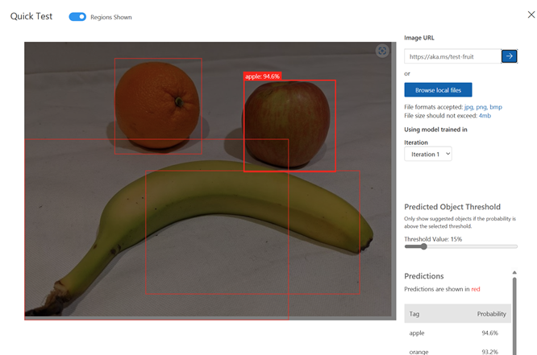

---
lab:
  title: Mendeteksi objek dalam gambar
  description: Gunakan layanan Azure AI Custom Vision untuk melatih model deteksi objek.
---

# Mendeteksi objek dalam gambar

Layanan **Azure AI Custom Vision** memungkinkan Anda membuat model penglihatan komputer yang dilatih berdasarkan gambar Anda sendiri. Anda dapat menggunakannya untuk melatih model *klasifikasi gambar* dan *deteksi objek*; yang kemudian dapat Anda publikasikan dan konsumsi dari aplikasi.

Dalam latihan ini, Anda akan menggunakan layanan Custom Vision untuk melatih model *deteksi objek* yang dapat mendeteksi dan menemukan tiga kelas buah (apel, pisang, dan jeruk) dalam sebuah gambar.

Meskipun latihan ini didasarkan pada SDK Python Azure Custom Vision, Anda dapat mengembangkan aplikasi visual menggunakan beberapa SDK khusus bahasa; termasuk:

* [Azure Custom Vision untuk JavaScript (pelatihan)](https://www.npmjs.com/package/@azure/cognitiveservices-customvision-training)
* [Azure Custom Vision untuk JavaScript (prediksi)](https://www.npmjs.com/package/@azure/cognitiveservices-customvision-prediction)
* [Azure Custom Vision untuk Microsoft .NET (pelatihan)](https://www.nuget.org/packages/Microsoft.Azure.CognitiveServices.Vision.CustomVision.Training/)
* [Azure Custom Vision untuk Microsoft .NET (prediksi)](https://www.nuget.org/packages/Microsoft.Azure.CognitiveServices.Vision.CustomVision.Prediction/)
* [Azure Custom Vision untuk Java (pelatihan)](https://search.maven.org/artifact/com.azure/azure-cognitiveservices-customvision-training/1.1.0-preview.2/jar)
* [Azure Custom Vision untuk Java (prediksi)](https://search.maven.org/artifact/com.azure/azure-cognitiveservices-customvision-prediction/1.1.0-preview.2/jar)

Latihan ini memakan waktu sekitar **45** menit.

## Buat sumber daya Custom Vision

Sebelum dapat melatih model, Anda memerlukan sumber daya Azure untuk *pelatihan* dan *prediksi*. Anda dapat membuat sumber daya **Custom Vision** untuk setiap tugas ini, atau Anda dapat membuat satu sumber daya dan menggunakannya untuk keduanya. Dalam latihan ini, Anda akan membuat sumber daya **Custom Vision** untuk pelatihan dan prediksi.

1. Buka [portal Azure](https://portal.azure.com) di `https://portal.azure.com` dan masuk menggunakan kredensial Azure Anda. Tutup pesan sambutan atau tips apa pun yang ditampilkan.
1. Pilih **Buat sumber daya**.
1. Di bilah pencarian, cari `Custom Vision`, pilih **Custom Vision**, dan buat sumber daya dengan pengaturan berikut:
    - **Buat opsi**: Keduanya
    - **Langganan**: *Langganan Azure Anda*
    - **Grup sumber daya**: *Buat atau pilih grup sumber daya*
    - **Wilayah**: *Pilih wilayah yang tersedia*
    - **Nama**: *Nama yang valid untuk sumber daya Custom Vision Anda*
    - **Tingkat harga pelatihan**: F0
    - **Tingkat harga prediksi**: F0

1. Buat sumber daya dan tunggu hingga penyebaran selesai, lalu lihat detail penyebaran. Perhatikan bahwa dua sumber daya Custom Vision tersedia; satu untuk pelatihan, dan lainnya untuk prediksi.

    > **Catatan**: Setiap sumber daya memiliki *titik akhir* dan *kunci* sendiri, yang digunakan untuk mengelola akses dari kode Anda. Untuk melatih model klasifikasi gambar, kode Anda harus menggunakan sumber daya *pelatihan* (dengan titik akhir dan kuncinya); dan untuk menggunakan model terlatih untuk memprediksi kelas gambar, kode Anda harus menggunakan sumber daya *prediksi* (dengan titik akhir dan kuncinya).

1. Ketika sumber daya telah disebarkan, buka grup sumber daya untuk melihatnya. Anda akan melihat dua sumber daya custom vision, satu dengan akhiran ***-Prediction***.

## Buat proyek Custom Vision di portal Custom Vision

Untuk melatih model deteksi objek, Anda perlu membuat proyek Custom Vision berdasarkan sumber daya pelatihan. Untuk melakukannya, Anda akan menggunakan portal Custom Vision.

1. Buka tab browser baru (dengan tetap membuka tab portal Azure - Anda akan kembali lagi nanti).
1. Di tab browser baru, buka [portal Custom Vision](https://customvision.ai) di `https://customvision.ai`. Jika diminta, masuk menggunakan kredensial Azure Anda dan setujui ketentuan layanan.
1. Buat proyek baru dengan pengaturan berikut:
    - **Nama**: `Detect Fruit`
    - **Deskripsi**: `Object detection for fruit.`
    - **Sumber Daya**: *Sumber daya Custom Vision*
    - **Jenis Proyek**: Deteksi Objek
    - **Domain**: Umum
1. Tunggu proyek dibuat dan dibuka di browser.

## Mengunggah dan menandai gambar

Sekarang setelah Anda memiliki proyek deteksi objek, Anda dapat mengunggah dan menandai gambar untuk melatih model.

### Unggah dan tandai gambar di portal Custom Vision

Portal Custom Vision menyertakan alat visual yang dapat Anda gunakan untuk mengunggah gambar dan menandai wilayah di dalamnya yang berisi beberapa jenis objek.

1. Di tab browser baru, unduh [gambar pelatihan](https://github.com/MicrosoftLearning/mslearn-ai-vision/raw/main/Labfiles/object-detection/training-images.zip) dari `https://github.com/MicrosoftLearning/mslearn-ai-vision/raw/main/Labfiles/object-detection/training-images.zip` dan ekstrak folder zip untuk melihat kontennya. Folder ini berisi gambar buah.
1. Di portal Custom Vision, di proyek deteksi objek Anda, pilih **Tambah gambar** dan unggah semua gambar dalam folder yang diekstrak.
1. Setelah gambar diunggah, pilih yang pertama untuk membukanya.
1. Tahan mouse di atas objek apa pun pada gambar hingga wilayah yang terdeteksi secara otomatis ditampilkan seperti gambar di bawah ini. Kemudian pilih objek, dan jika perlu ubah ukuran wilayah untuk mengelilinginya.

    

    Atau, Anda cukup menyeret objek untuk membuat wilayah.

1. Saat wilayah mengelilingi objek, tambahkan tag baru dengan jenis objek yang sesuai (*apel*, *pisang*, atau *jeruk*) seperti yang ditunjukkan di sini:

    

1. Pilih dan beri tag satu sama lain pada objek dalam gambar, ubah ukuran wilayah dan tambahkan tag baru sesuai kebutuhan.

    

1. Gunakan tautan **>** di sebelah kanan untuk membuka gambar berikutnya, dan beri tag pada objeknya. Kemudian terus kerjakan seluruh kumpulan gambar, beri tag pada setiap apel, pisang, dan jeruk.

1. Setelah Anda selesai memberi tag pada gambar terakhir, tutup editor **Detail Gambar** . Pada halaman **Gambar Pelatihan** di bawah **Tag**, pilih **Ditandai** untuk melihat semua gambar yang ditandai:


### Gunakan portal Custom Vision untuk mengunggah gambar

Anda dapat menggunakan UI di portal Custom Vision untuk menandai gambar Anda, tetapi banyak tim pengembangan AI menggunakan alat lain yang menghasilkan file yang berisi informasi tentang tag dan wilayah objek dalam gambar. Dalam skenario seperti ini, Anda dapat menggunakan API pelatihan Custom Vision untuk mengunggah gambar yang ditandai ke proyek.

1. Klik ikon *pengaturan* (&#9881;) di kanan atas halaman **Gambar Pelatihan** di portal Custom Vision untuk melihat pengaturan proyek.
1. Di bawah **Umum** (di sebelah kiri), perhatikan **Project Id** yang secara unik mengidentifikasi proyek ini.
1. Di sebelah kanan, di bagian **Sumber daya**, perhatikan bahwa **Kunci** dan **Titik Akhir** ditampilkan. Ini adalah detail untuk sumber daya *pelatihan* (Anda juga dapat memperoleh informasi ini dengan melihat sumber daya di portal Microsoft Azure).
1. Kembali ke tab browser yang berisi portal Azure (dengan membiarkan tab portal Custom Vision terbuka - Anda akan kembali nanti).
1. Di portal Azure, gunakan tombol **[\>_]** di sebelah kanan bilah pencarian di bagian atas halaman untuk membuat Cloud Shell baru di portal Azure, dengan memilih lingkungan ***PowerShell ***dengan tidak ada penyimpanan pada langganan Anda.

    Cloud shell menyediakan antarmuka baris perintah dalam panel di bagian bawah portal Azure.

    > **Catatan**: Jika sebelumnya Anda telah membuat cloud shell yang menggunakan lingkungan *Bash* , alihkan ke ***PowerShell***.

    > **Catatan**: Jika portal meminta Anda untuk memilih penyimpanan untuk mempertahankan file Anda, pilih **Tidak ada akun penyimpanan yang diperlukan**, pilih langganan yang Anda gunakan dan tekan **Terapkan**.

1. Di toolbar cloud shell, di menu **Pengaturan**, pilih **Buka versi Klasik** (ini diperlukan untuk menggunakan editor kode).

    **<font color="red">Pastikan Anda telah beralih ke versi klasik cloud shell sebelum melanjutkan.</font>**

1. Ubah ukuran panel cloud shell sehingga Anda dapat melihat lebih banyak.

    > **Tips**" Anda bisa mengubah ukuran panel dengan menyeret batas atas. Anda juga dapat menggunakan tombol minimalkan dan maksimalkan untuk beralih antara shell cloud dan antarmuka portal utama.

1. Di panel cloud shell, masukkan perintah berikut untuk mengkloning repo GitHub yang berisi file kode untuk latihan ini (ketik perintah, atau salin ke clipboard lalu klik kanan di baris perintah dan tempel sebagai teks biasa):

    ```
    rm -r mslearn-ai-vision -f
    git clone https://github.com/MicrosoftLearning/mslearn-ai-vision
    ```

    > **Tips**: Saat Anda menempelkan perintah ke cloudshell, ouput mungkin mengambil sejumlah besar buffer layar. Anda dapat menghapus layar dengan memasukkan `cls` perintah untuk mempermudah fokus pada setiap tugas.

1. Setelah repositori dikloning, gunakan perintah berikut untuk menavigasi ke folder berisi file kode aplikasi:

    ```
   cd mslearn-ai-vision/Labfiles/object-detection/python/train-detector
   ls -a -l
    ```

    Folder berisi konfigurasi aplikasi dan file kode untuk aplikasi Anda. Folder ini juga berisi file **tagged-images.json** yang berisi koordinat kotak pembatas untuk objek dalam beberapa gambar, dan subfolder **/images**, yang berisi gambar.

1. Instal paket SDK Azure AI Custom Vision untuk pelatihan dan paket lain yang diperlukan dengan menjalankan perintah berikut:

    ```
   python -m venv labenv
   ./labenv/bin/Activate.ps1
   pip install -r requirements.txt azure-cognitiveservices-vision-customvision
    ```

1. Masukkan perintah berikut untuk mengedit file konfigurasi untuk aplikasi Anda:

    ```
   code .env
    ```

    File dibuka dalam editor kode.

1. Dalam file kode, perbarui nilai konfigurasi yang ada di dalamnya untuk mencerminkan **Titik Akhir** dan **Kunci** autentikasi untuk sumber daya *pelatihan* Custom Vision Anda, dan **ID Proyek** untuk proyek custom vision yang Anda buat sebelumnya.
1. Setelah Anda mengganti tempat penampung, dalam editor kode, gunakan perintah **CTRL+S** untuk menyimpan perubahan Anda lalu gunakan perintah **CTRL+Q** untuk menutup editor kode sambil menjaga baris perintah cloud shell tetap terbuka.
1. Di baris perintah cloud shell, masukkan perintah berikut untuk membuka file **tagged-images.json** untuk melihat informasi pemberian tag untuk file gambar di subfolder **/images**:

    ```
   code tagged-images.json
    ```
    
     JSON menentukan daftar gambar, masing-masing berisi satu atau beberapa wilayah yang ditandai. Setiap wilayah yang diberi tag menyertakan nama tag, dan koordinat dan lebar serta lebar dan tinggi atas kotak pembatas yang berisi objek yang diberi tag.

    > **Catatan**: Koordinat dan dimensi dalam file ini menunjukkan titik relatif pada gambar. Misalnya, nilai *height* 0,7 menunjukkan kotak yang 70% dari tinggi gambar. Beberapa alat pemberian tag menghasilkan format file lain di mana nilai koordinat dan dimensi mewakili piksel, inci, atau unit pengukuran lainnya.

1. Tutup file JSON tanpa menyimpan perubahan apa pun (*CTRL_Q*).

1. Di baris perintah cloud shell, masukkan perintah berikut untuk membuka file kode untuk aplikasi klien:

    ```
   code add-tagged-images.py
    ```

1. Perhatikan detail berikut dalam file kode:
    - Namespace layanan untuk SDK Azure AI Custom Vision diimpor.
    - Fungsi **Utama** mengambil pengaturan konfigurasi, dan menggunakan kunci dan titik akhir untuk membuat **CustomVisionTrainingClient** yang diautentikasi, yang kemudian digunakan dengan ID proyek untuk membuat **Proyek** referensi ke proyek Anda.
    - Fungsi **Upload_Images** mengekstrak informasi wilayah yang diberi tag dari file JSON dan menggunakannya untuk membuat batch gambar dengan wilayah, yang kemudian diunggah ke proyek.

1. Tutup editor kode (*CTRL+Q*) dan masukkan perintah berikut untuk menjalankan program:

    ```
   python add-tagged-images.py
    ```

1. Tunggu hingga program berakhir.
1. Kembali ke tab browser Anda yang berisi portal Custom Vision (sambil tetap membuka tab Cloud Shell portal Azure), dan lihat halaman **Gambar Pelatihan** untuk proyek Anda (muat ulang browser jika perlu).
1. Verifikasi bahwa beberapa gambar baru yang diberi tag telah ditambahkan ke proyek.

## Latih dan uji model

Sekarang setelah memberi tag gambar dalam proyek, Anda siap untuk melatih model.

1. Dalam proyek Custom Vision, klik **Latih** (&#9881;<sub>&#9881;</sub>) untuk melatih model deteksi objek menggunakan gambar yang ditandai. Pilih opsi **Pelatihan Cepat**.
1. Tunggu hingga pelatihan selesai (mungkin perlu waktu sepuluh menit atau lebih).

    > **Tips**: Azure Cloud Shell memiliki batas waktu tidak aktif 20 menit, setelah sesi ditinggalkan. Sementara menunggu pelatihan selesai, kembali sesekali ke cloud shell dan masukkan perintah seperti `ls` untuk menjaga sesi tetap aktif.

1. Di portal Custom Vision, saat pelatihan selesa, tinjau metrik performa *Presisi*, *Pengenalan*, dan *mAP*. Metrik ini mengukur akurasi prediksi model deteksi objek, dan semuanya harus tinggi.
1. Di kanan atas halaman, klik **Uji Cepat**, lalu di kotak **URL Gambar**, ketik `https://aka.ms/test-fruit` dan klik tombol *gambar uji cepat* (&#10132;).
1. Lihat prediksi yang dihasilkan.

    

1. Tutup jendela **Uji Cepat**.

## Menggunakan detektor objek dalam aplikasi klien

Sekarang Anda siap untuk menerbitkan model terlatih dan menggunakannya di aplikasi klien.

### Terbitkan model deteksi objek

1. Di portal Visi Khusus, pada halaman **Kinerja**, klik **&#128504; Publikasikan** untuk memublikasikan model terlatih dengan pengaturan berikut:
    - **Nama model**: `fruit-detector`
    - **Sumber Daya Prediksi**: *Sumber daya **prediksi** yang Anda buat sebelumnya yang diakhiri dengan "-Prediction" (<u>bukan</u> sumber pelatihan)*.
1. Di kiri atas halaman **Pengaturan Proyek**, klik ikon *Galeri Proyek* (&#128065;) untuk kembali ke beranda portal Custom Vision, tempat proyek Anda sekarang terdaftar.
1. Pada beranda portal Custom Vision, di kanan atas, klik ikon *pengaturan* (&#9881;) untuk melihat pengaturan layanan Custom Vision Anda. Kemudian, di bawah **Sumber Daya**, temukan sumber daya *prediksi* Anda yang diakhiri dengan "-Prediksi" (<u>bukan</u> sumber daya pelatihan) untuk menentukan **Kunci** dan nilai **Titik Akhir** (Anda juga dapat memperoleh informasi ini dengan melihat sumber daya di portal Microsoft Azure).

## Gunakan pengklasifikasi gambar dari aplikasi klien

Sekarang setelah Anda memublikasikan model klasifikasi gambar, Anda dapat menggunakannya dari aplikasi klien. Sekali lagi, Anda dapat memilih untuk menggunakan **C#** atau **Python**.

1. Kembali ke tab browser berisi portal Azure dan panel cloud shell.
1. Di cloud shell, jalankan perintah berikut untuk beralih ke folder untuk aplikasi klien Anda dan lihat file yang ada di dalamnya:

    ```
   cd ../test-detector
   ls -a -l
    ```

    Folder berisi konfigurasi aplikasi dan file kode untuk aplikasi Anda. Folder ini juga berisi file gambar **produce.jpg** berikut, yang akan Anda gunakan untuk menguji model Anda.

    

1. Instal paket SDK Azure AI Custom Vision untuk prediksi dan paket lain yang diperlukan dengan menjalankan perintah berikut:

    ```
   python -m venv labenv
   ./labenv/bin/Activate.ps1
   pip install -r requirements.txt azure-cognitiveservices-vision-customvision
    ```

1. Masukkan perintah berikut untuk mengedit file konfigurasi untuk aplikasi Anda:

    ```
   code .env
    ```

    File dibuka dalam editor kode.

1. Perbarui nilai konfigurasi untuk mencerminkan **Titik Akhir** dan **Kunci** untuk sumber daya *<u>prediksi</u>* Custom Vision Anda, **ID Proyek** untuk proyek deteksi objek, dan nama model yang Anda publikasikan (seharusnya *fruit-detector*). Simpan perubahan Anda (*CTRL+S*) dan tutup editor kode (*CTRL+Q*).

1. Di baris perintah cloud shell, masukkan perintah berikut untuk membuka file kode untuk aplikasi klien:

    ```
   code test-detector.py
    ```

1. Tinjau kode, catat detail berikut:
    - Namespace layanan untuk SDK Azure AI Custom Vision diimpor.
    - Fungsi **Utama** mengambil pengaturan konfigurasi, dan menggunakan kunci dan titik akhir untuk membuat **CustomVisionPredictionClient** yang diautentikasi.
    - Objek klien prediksi digunakan untuk mendapatkan prediksi deteksi objek untuk gambar **produce.jpg**, menentukan ID proyek dan nama model dalam permintaan. Wilayah yang ditandai yang diprediksi kemudian digambar pada gambar, dan hasilnya disimpan sebagai **output.jpg**.
1. Tutup editor kode dan masukkan perintah berikut untuk menjalankan program:

    ```
   python test-detector.py
    ```

1. Tinjau output program, yang mencantumkan setiap objek yang terdeteksi dalam gambar.
1. Perhatikan bahwa file gambar bernama **output.jpg** dihasilkan. Gunakan perintah **unduhan** (khusus Azure Cloud Shell) untuk mengunduhnya:

    ```
   download output.jpg
    ```

    Perintah unduh membuat tautan popup di kanan bawah browser Anda, yang dapat Anda pilih untuk mengunduh dan membuka file. Gambar akan tampak seperti berikut ini:

    

## Membersihkan sumber daya

Jika Anda tidak menggunakan sumber daya Azure yang dibuat di lab ini untuk modul pelatihan lainnya, Anda dapat menghapusnya untuk menghindari dikenakan biaya lebih lanjut.

1. Buka portal Microsoft Azure di`https://portal.azure.com`, dan di bilah pencarian atas, cari sumber daya yang Anda buat di lab ini.

1. Pada halaman sumber daya, pilih **Hapus** dan ikuti instruksi untuk menghapus sumber daya. Atau, Anda dapat menghapus seluruh grup sumber daya untuk membersihkan semua sumber daya secara bersamaan.
   
## Informasi selengkapnya

Untuk informasi lebih lanjut tentang deteksi objek dengan layanan Custom Vision, lihat [dokumentasi Custom Vision](https://docs.microsoft.com/azure/cognitive-services/custom-vision-service/).
