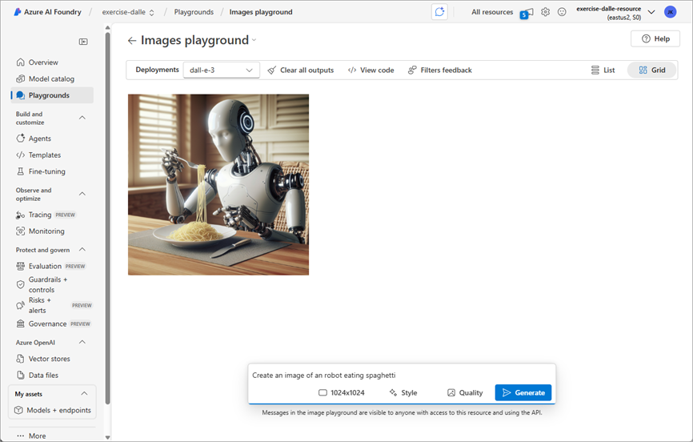

---
lab:
  title: Hasilkan gambar dengan AI
  description: Gunakan model OpenAI a DALL-E di Azure AI Foundry untuk menghasilkan gambar.
---

# Hasilkan gambar dengan AI

Dalam latihan ini, Anda menggunakan model AI generatif OpenAI DALL-E untuk menghasilkan gambar. Anda juga menggunakan SDK Python OpenAI untuk membuat aplikasi sederhana guna menghasilkan gambar berdasarkan perintah.

> **Catatan**: Latihan ini didasarkan pada perangkat lunak SDK pra-rilis, yang mungkin dapat berubah. Jika perlu, kami telah menggunakan versi paket tertentu; yang mungkin tidak mencerminkan versi terbaru yang tersedia. Anda mungkin mengalami beberapa perilaku, peringatan, atau kesalahan tak terduga.

Meskipun latihan ini didasarkan pada SDK Python Azure OpenAI, Anda dapat mengembangkan aplikasi obrolan AI menggunakan beberapa SDK khusus bahasa; termasuk:

* [Proyek OpenAI untuk Microsoft .NET](https://www.nuget.org/packages/OpenAI)
* [Proyek OpenAI untuk JavaScript](https://www.npmjs.com/package/openai)

Latihan ini memakan waktu sekitar **30** menit.

## Buka portal Azure AI Foundry

Mari kita mulai dengan menjelajahi portal Azure AI Foundry.

1. Di browser web, buka [portal Azure AI Foundry](https://ai.azure.com) di `https://ai.azure.com` dan masuk menggunakan kredensial Azure Anda. Tutup semua tips atau panel mulai cepat yang terbuka saat pertama kali Anda masuk, dan jika perlu, gunakan logo **Azure AI Foundry** di kiri atas untuk menavigasi ke beranda, yang tampilannya mirip dengan gambar berikut (tutup panel **Bantuan** jika terbuka):

    

1. Tinjau informasi di halaman beranda.

## Memilih model untuk memulai proyek

*Proyek* Azure AI menyediakan ruang kerja kolaboratif untuk pengembangan AI. Mari kita mulai dengan memilih model yang ingin kita kerjakan dan membuat proyek untuk menggunakannya.

> **Catatan**: Proyek AI Foundry dapat didasarkan pada *sumber daya Azure AI Foundry*yang menyediakan akses ke model AI (termasuk Azure OpenAI), layanan Azure AI, dan sumber daya lainnya untuk mengembangkan agen AI dan solusi obrolan. Alternatifnya, proyek dapat didasarkan pada sumber daya *pusat penyimpanan AI*; yang mencakup koneksi ke sumber daya Azure untuk penyimpanan, komputasi, dan alat khusus yang aman. Proyek berbasis Azure AI Foundry sangat bagus untuk pengembang yang ingin mengelola sumber daya untuk agen AI atau pengembangan aplikasi obrolan. Proyek berbasis pusat penyimpanan AI lebih cocok untuk tim pengembangan perusahaan yang mengerjakan solusi AI yang kompleks.

1. Di beranda, pada bagian **Jelajahi model dan kemampuan** , cari`dall-e-3` model; yang akan kita gunakan dalam proyek kita.

1. Dalam hasil pencarian, pilih model **dall-e-3** untuk melihat detailnya, lalu di bagian atas halaman model, pilih **Gunakan model ini**.

1. Saat diminta untuk membuat proyek, masukkan nama yang valid untuk proyek Anda dan perluas **Opsi tingkat lanjut**.

1. Pilih **Kustomisasi** dan tentukan pengaturan berikut untuk hub Anda:
    - **Sumber daya Azure AI Foundry**: *Nama yang valid untuk sumber daya Azure AI Foundry Anda*
    - **Langganan**: *Langganan Azure Anda*
    - **Grup sumber daya**: *Buat atau pilih grup sumber daya*
    - **Wilayah**: *Pilih **AI Foundry yang direkomendasikan***\*

    > \* Sumber daya Azure OpenAI dibatasi oleh kuota model regional. Jika batas kuota terlampaui di kemudian hari dalam latihan, Anda mungkin perlu membuat sumber daya lain di wilayah yang berbeda.

1. Pilih **Buat** dan tunggu proyek Anda, termasuk penggunaan model dall-e-3 yang Anda pilih, untuk membuatnya.

    > Catatan: Bergantung pada pilihan model Anda, Anda mungkin menerima perintah tambahan selama proses pembuatan proyek. Setujui ketentuan dan selesaikan penyebaran.

1. Saat proyek Anda dibuat, model Anda akan ditampilkan di halaman **titik akhir Model +**.

## Menguji model di playground

Sebelum membuat aplikasi klien, mari kita uji model DALL-E di playground.

1. Pilih **Playground**, lalu **Playground gambar**.

1. Pastikan penyebaran model DALL-E Anda dipilih. Kemudian, dalam kotak di dekat bagian bawah halaman, masukkan perintah seperti `Create an image of an robot eating spaghetti` dan pilih **Buat**.

1. Tinjau gambar yang dihasilkan di playground:

    

1. Masukkan perintah tindak lanjut, seperti `Show the robot in a restaurant` dan tinjau gambar yang dihasilkan.

1. Lanjutkan pengujian dengan perintah baru untuk menyempurnakan gambar sampai Anda puas dengannya. 

1. Pilih tombol **\</\> Lihat Kode** dan pastikan Anda berada di tab **Autentikasi Entra ID**. Lalu, rekam informasi berikut untuk digunakan nanti di latihan. Perhatikan bahwa nilainya adalah contoh, pastikan untuk mencatat informasi dari penyebaran Anda.

    * Titik Akhir OpenAI: *https://dall-e-aus-resource.cognitiveservices.azure.com/*
    * Versi OpenAI API: *2024-04-01-preview*
    * Nama penyebaran (nama model): *dall-e-3*

## Membuat aplikasi klien

Model ini tampaknya bekerja di playground. Sekarang Anda dapat menggunakan SDK OpenAI untuk menggunakannya di aplikasi klien.

### Menyiapkan konfigurasi aplikasi

1. Buka tab browser baru (biarkan portal Azure AI Foundry tetap terbuka di tab yang sudah ada). Kemudian di tab baru, telusuri [Portal Azure](https://portal.azure.com) di `https://portal.azure.com`; masuk menggunakan kredensial Azure Anda jika diminta.

1. Gunakan tombol **[\>_]** di sebelah kanan bilah pencarian di bagian atas halaman untuk membuat Cloud Shell baru di portal Azure, dengan memilih lingkungan ***PowerShell***. Cloud shell menyediakan antarmuka baris perintah dalam panel di bagian bawah portal Azure.

    > **Catatan**: Jika sebelumnya Anda telah membuat cloud shell yang menggunakan lingkungan *Bash* , alihkan ke ***PowerShell***.

    > **Catatan**: Jika portal meminta Anda untuk memilih penyimpanan untuk mempertahankan file Anda, pilih **Tidak ada akun penyimpanan yang diperlukan**, pilih langganan yang Anda gunakan dan tekan **Terapkan**.

1. Di toolbar cloud shell, di menu **Pengaturan**, pilih **Buka versi Klasik** (ini diperlukan untuk menggunakan editor kode).

    **<font color="red">Pastikan Anda telah beralih ke versi klasik cloud shell sebelum melanjutkan.</font>**

1. Di panel cloud shell, masukkan perintah berikut untuk mengkloning repo GitHub yang berisi file kode untuk latihan ini (ketik perintah, atau salin ke clipboard lalu klik kanan di baris perintah dan tempel sebagai teks biasa):

    ```
    rm -r mslearn-ai-vision -f
    git clone https://github.com/MicrosoftLearning/mslearn-ai-vision
    ```

    > **Tips**: Saat Anda menempelkan perintah ke cloudshell, ouput mungkin mengambil sejumlah besar buffer layar. Anda dapat menghapus layar dengan memasukkan `cls` perintah untuk mempermudah fokus pada setiap tugas.

1. Setelah repositori dikloning, navigasikan ke folder yang berisi file kode aplikasi obrolan:  

    ```
   cd mslearn-ai-vision/Labfiles/dalle-client/python
    ```

1. Di panel baris perintah cloud shell, masukkan perintah berikut untuk menginstal pustaka yang akan Anda gunakan:

    ```
   python -m venv labenv
   ./labenv/bin/Activate.ps1
   pip install -r requirements.txt azure-identity openai requests
    ```

1. Masukkan perintah berikut untuk mengedit file konfigurasi yang telah disediakan:

    ```
   code .env
    ```

    File dibuka dalam editor kode.

1. Ganti tempat penampung **your_endpoint**, **your_model_deployment**, dan **your_api_version** dengan nilai yang Anda catat dari **playground Gambar**.

1. Setelah Anda mengganti tempat penampung, gunakan perintah **CTRL+S** untuk menyimpan perubahan Anda lalu gunakan perintah **CTRL+Q** untuk menutup editor kode sambil menjaga baris perintah cloud shell tetap terbuka.

### Menulis kode untuk menyambungkan ke proyek Anda dan mengobrol dengan model Anda

> **Tips**: Saat Anda menambahkan kode, pastikan untuk mempertahankan indentasi yang benar.

1. Masukkan perintah berikut untuk mengedit file kode yang telah disediakan:

    ```
   code dalle-client.py
    ```

1. Dalam file kode, perhatikan pernyataan yang sudah ada yang telah ditambahkan di bagian atas file untuk mengimpor namespace SDK yang diperlukan. Kemudian, di bawah komentar **Tambahkan referensi**, tambahkan kode berikut untuk mereferensikan namespace di pustaka yang Anda instal sebelumnya:

    ```python
   # Add references
   from dotenv import load_dotenv
   from azure.identity import DefaultAzureCredential, get_bearer_token_provider
   from openai import AzureOpenAI
   import requests
    ```

1. Dalam fungsi **utama**, di bawah komentar **Dapatkan pengaturan konfigurasi**, perhatikan bahwa kode memuat nilai titik akhir, versi API, dan nama penyebaran model yang Anda tentukan dalam file konfigurasi.

1. Di bawah komentar **Inisialisasi klien**, tambahkan kode berikut untuk menghubungkan model Anda menggunakan kredensial Azure yang Anda gunakan untuk masuk saat ini:

    ```python
   # Initialize the client
   token_provider = get_bearer_token_provider(
       DefaultAzureCredential(exclude_environment_credential=True,
           exclude_managed_identity_credential=True), 
       "https://cognitiveservices.azure.com/.default"
   )
    
   client = AzureOpenAI(
       api_version=api_version,
       azure_endpoint=endpoint,
       azure_ad_token_provider=token_provider
   )
    ```

1. Perhatikan bahwa kode menyertakan perulangan untuk memungkinkan pengguna memasukkan perintah hingga mereka memasukkan "berhenti". Selanjutnya, di bagian perulangan, di bawah komentar **Hasilkan sebuah gambar**, tambahkan kode berikut untuk mengirimkan perintah dan mengambil URL untuk gambar yang dihasilkan dari model Anda:

    **Python**

    ```python
   # Generate an image
   result = client.images.generate(
        model=model_deployment,
        prompt=input_text,
        n=1
    )

   json_response = json.loads(result.model_dump_json())
   image_url = json_response["data"][0]["url"] 
    ```

1. Perhatikan bahwa kode di sisa fungsi **utama** meneruskan URL gambar dan nama file ke fungsi yang disediakan, yang mengunduh gambar yang dihasilkan dan menyimpannya sebagai file .png.

1. Gunakan perintah **CTRL+S** untuk menyimpan perubahan Anda ke file kode lalu gunakan perintah **CTRL+Q** untuk menutup editor kode sambil menjaga baris perintah cloud shell tetap terbuka.

### Jalankan aplikasi klien

1. Di panel baris perintah cloud shell, masukkan perintah berikut untuk menjalankan aplikasinya:

    ```
   az login
    ```

    **<font color="red">Anda harus masuk ke Azure - meskipun sesi cloud shell sudah diautentikasi.</font>**

    > **Catatan**: Dalam sebagian besar skenario, hanya menggunakan *login* az sudah cukup. Namun, jika Anda memiliki langganan di berbagai penyewa, Anda mungkin perlu menentukan penyewa dengan menggunakan *parameter --penyewa* . Lihat [Masuk ke Azure secara interaktif menggunakan Azure CLI](https://learn.microsoft.com/cli/azure/authenticate-azure-cli-interactively) untuk detailnya.

1. Saat diperintahkan, ikuti instruksi untuk membuka halaman masuk di tab baru dan masukkan kode autentikasi yang diberikan dan kredensial Azure Anda. Kemudian selesaikan proses masuk di baris perintah, pilih langganan yang berisi pusat penyimpanan Azure AI Foundry jika diperintahkan.

1. Di panel baris perintah cloud shell, masukkan perintah berikut untuk menjalankan aplikasinya:

    ```
   python dalle-client.py
    ```

1. Saat diminta, masukkan permintaan untuk gambar, seperti `Create an image of a robot eating pizza`. Setelah beberapa saat, aplikasi harusnya mengonfirmasi bahwa gambar telah disimpan.

1. Coba beberapa perintah lagi. Setelah selesai, tekan enter `quit` untuk mengakhiri program.

    > **Catatan**: Dalam aplikasi sederhana ini, kita belum menerapkan logika untuk mempertahankan riwayat percakapan; sehingga model akan memperlakukan setiap perintah sebagai permintaan baru tanpa konteks perintah sebelumnya.

1. Untuk mengunduh dan melihat gambar yang dihasilkan oleh aplikasi Anda, gunakan perintah **unduhan **shell cloud - menentukan file .png yang dihasilkan:

    ```
   download ./images/image_1.png
    ```

    Perintah unduh membuat tautan popup di kanan bawah browser Anda, yang dapat Anda pilih untuk mengunduh dan membuka file.

## Ringkasan

Dalam latihan ini, Anda menggunakan Azure AI Foundry dan SDK Azure OpenAI untuk membuat aplikasi klien menggunakan model DALL-E untuk menghasilkan gambar.

## Penghapusan

Setelah selesai menjelajahi DALL-E, Anda harus menghapus sumber daya yang telah Anda buat dalam latihan ini untuk menghindari biaya Azure yang tidak perlu.

1. Kembali ke tab browser yang berisi portal Azure (atau buka kembali [portal Azure](https://portal.azure.com) di `https://portal.azure.com` tab browser baru) dan lihat konten grup sumber daya tempat Anda menyebarkan sumber daya yang digunakan dalam latihan ini.
1. Pada toolbar pilih **Hapus grup sumber daya**.
1. Masukkan nama grup sumber daya untuk mengonfirmasi bahwa Anda ingin menghapusnya, dan pilih Hapus.
